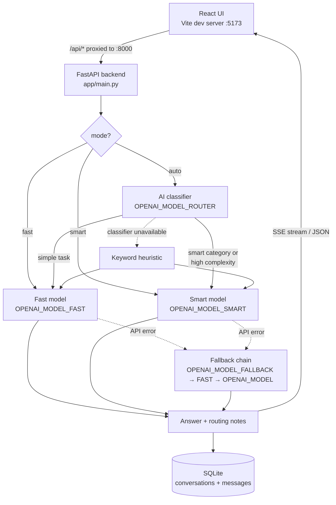

# AI Orchestrator

A local AI workbench that routes every request to the cheapest model that can handle it. A tiny classifier model looks at each question and dispatches it to a **fast** tier (quick facts, chat, summaries, reformatting) or a **smart** tier (coding, debugging, reasoning, planning, math, analysis) — so you stop paying flagship-model prices for questions a mini model answers just as well. Conversations are saved to SQLite with automatic titling, answers stream token-by-token over SSE, and a fallback chain keeps requests succeeding even when the primary model errors. A React UI sits on top; the whole thing runs on your machine with one API key.

## Architecture



Request lifecycle for a conversation ask: the user message is persisted first, the last 12 messages are folded into a context prompt, the router picks a model, the answer streams back (or returns as JSON), and the assistant message is persisted with its routing metadata before the terminal event is sent.

## Features

- **AI-based routing** — a cheap classifier model (`OPENAI_MODEL_ROUTER`) categorises each request and picks the fast or smart tier; a keyword heuristic takes over if the classifier is unavailable, so `auto` mode never blocks on the router.
- **Model fallback chain** — if the primary model call fails with an API error, the orchestrator retries through `OPENAI_MODEL_FALLBACK`, then `OPENAI_MODEL_FAST`, then `OPENAI_MODEL` (duplicates and the failed model removed) and tags the result `->fallback`.
- **SSE streaming** — answers stream incrementally over `text/event-stream` with a strict `meta` / `delta` / `done` / `error` event contract.
- **Conversation persistence + auto-titling** — conversations and messages live in SQLite; the first question of a generically-titled conversation becomes its title (trimmed to 70 chars).
- **Optional bearer auth** — set `API_AUTH_TOKEN` and every `/v1` endpoint except `/v1/status` requires `Authorization: Bearer <token>`; leave it unset for a zero-friction local setup.
- **Optional rate limiting** — set `RATE_LIMIT` (e.g. `60/minute`) to throttle the ask endpoints per client IP; unset leaves them unthrottled.
- **Per-tier budgets** — separate max-output-token limits and reasoning-effort levels for the fast and smart tiers, so quick answers stay quick and hard problems get room to think.
- **Telemetry** — every request gets a UUID request id and elapsed-ms timing, surfaced in the response `notes` and in structured logs.

## Quickstart

### Backend

```bash
python -m venv venv

# Windows
venv\Scripts\activate
# macOS / Linux
source venv/bin/activate

pip install -r requirements.txt

# Windows
copy .env.example .env
# macOS / Linux
cp .env.example .env
# then edit .env and set OPENAI_API_KEY

uvicorn app.main:app --reload --port 8000
```

### Frontend

```bash
cd frontend
npm install
npm run dev
```

Open <http://localhost:5173>. The Vite dev server proxies `/api/*` to the backend at `http://127.0.0.1:8000` (stripping the `/api` prefix), so no CORS setup is needed for local development.

The UI gives you a conversation sidebar (create / rename / delete), a mode picker (auto / fast / smart), live streaming answers with markdown rendering, dark mode, and an optional token field for when the backend runs with `API_AUTH_TOKEN` set.

## Configuration

All configuration is via environment variables, loaded from `.env` (gitignored — copy `.env.example` and fill in your key).

| Variable | Default | Purpose |
| --- | --- | --- |
| `OPENAI_API_KEY` | — (required) | Your OpenAI API key. Validated on the first ask; if it is missing, ask calls return an empty answer with an explanatory `notes` instead of raising. |
| `OPENAI_MODEL` | `gpt-5` | Base/default model. Used when a tier variable below is unset, and as the last entry in the failure fallback chain. |
| `OPENAI_MODEL_ROUTER` | `gpt-5-nano` | Cheap classifier used in `auto` mode to pick a tier. Keep this small — it runs on every auto request. |
| `OPENAI_MODEL_FAST` | `gpt-5-mini` | Fast tier: quick facts, chat, summaries, reformatting. |
| `OPENAI_MODEL_SMART` | `gpt-5` | Smart tier: coding, debugging, reasoning, planning, math, analysis, creative writing. |
| `OPENAI_MODEL_FALLBACK` | `gpt-5-mini` | First candidate tried when the primary model call fails. Should differ from the primary so a model-specific outage can actually fall back. |
| `FAST_MAX_OUTPUT_TOKENS` | `1500` | Output-token cap for the fast tier. Includes model reasoning tokens, so leave headroom. |
| `SMART_MAX_OUTPUT_TOKENS` | `4000` | Output-token cap for the smart tier. |
| `FAST_REASONING_EFFORT` | `low` | Reasoning effort requested from the fast-tier model. |
| `SMART_REASONING_EFFORT` | `medium` | Reasoning effort requested from the smart-tier model. |
| `OPENAI_TIMEOUT_SECONDS` | `120` | Timeout for answer-model calls (the router classifier uses its own short internal timeout). |
| `API_AUTH_TOKEN` | unset | When set, every `/v1` endpoint except `/v1/status` requires `Authorization: Bearer <token>`. Unset = auth disabled. |
| `ALLOWED_ORIGINS` | `http://localhost:5173,http://127.0.0.1:5173` | Comma-separated CORS origins, for serving the UI from somewhere other than the Vite proxy. |
| `RATE_LIMIT` | unset | Per-client-IP limit on the ask endpoints (slowapi syntax, e.g. `60/minute`). Unset = no rate limiting. |
| `DATABASE_PATH` | `ai_orchestrator.db` | SQLite database file path. |

**The tiers must point at genuinely different models.** If `OPENAI_MODEL_FAST` and `OPENAI_MODEL_SMART` resolve to the same model, routing degenerates into a no-op that still pays for a classifier call on every auto request — all cost, no benefit. The same logic applies to `OPENAI_MODEL_FALLBACK`: a fallback identical to the primary cannot rescue a model-specific outage.

## API reference

Base URL: `http://127.0.0.1:8000` (or `/api` through the Vite proxy). When `API_AUTH_TOKEN` is set, send `Authorization: Bearer <token>` on every `/v1` endpoint except `/v1/status`; `/` and `/health` are always open.

### Service

| Method | Path | Body | Response |
| --- | --- | --- | --- |
| `GET` | `/` | — | `{"status": "ok", "service": "ai-orchestrator"}` |
| `GET` | `/health` | — | `{"status": "ok"}` |
| `GET` | `/v1/status` | — | `{"status": "ok", "service": "ai-orchestrator", "version": "0.1.0", "auth_enabled": bool, "models": {"router": str, "fast": str, "smart": str, "fallback": str}}` (never requires auth; `models` reflects the configured tier env vars and never includes the API key) |

### One-shot ask

| Method | Path | Body | Response |
| --- | --- | --- | --- |
| `POST` | `/v1/ask` | `{"question": str, "mode": "auto"\|"fast"\|"smart"}` (`mode` defaults to `"auto"`) | `{"answer": str, "mode_used": str, "notes": str}` |

`notes` always carries the routing explanation, the request id, and elapsed milliseconds, e.g. `AI router: task=coding complexity=medium -> SMART model gpt-5 | request_id=... | ms=4211`. On unrecoverable errors (bad API key, rate limiting, exhausted fallbacks) the endpoint still returns `200` with an empty `answer` and an explanatory `notes`.

### Conversations

| Method | Path | Body | Response |
| --- | --- | --- | --- |
| `GET` | `/v1/conversations` | — | `[{"id": int, "title": str, "created_at": str, "updated_at": str}, ...]` (most recently updated first) |
| `POST` | `/v1/conversations` | `{"title": str}` (defaults to `"Untitled conversation"`) | The created conversation object |
| `PATCH` | `/v1/conversations/{id}` | `{"title": str}` | The updated conversation object; `404` if not found |
| `DELETE` | `/v1/conversations/{id}` | — | `{"status": "deleted", "conversation_id": int}`; `404` if not found |
| `GET` | `/v1/conversations/{id}/messages` | — | `[{"id": int, "conversation_id": int, "role": str, "content": str, "mode_used": str\|null, "notes": str\|null, "created_at": str}, ...]`; `404` if not found |
| `POST` | `/v1/conversations/{id}/ask` | Same body as `/v1/ask` | Same shape as `/v1/ask`, with `\| context_messages=N` appended to `notes`; `404` if not found |

A conversation ask persists the user message, builds a context prompt from the last 12 prior messages, runs the orchestrator, then persists the assistant message with its `mode_used` and `notes`. If it is the first message and the conversation still has a generic title, the question becomes the title (auto-titling).

### Streaming ask (SSE)

```
POST /v1/conversations/{id}/ask/stream
Body: {"question": str, "mode": "auto"|"fast"|"smart"}
Response: text/event-stream
```

Frames are `event: <name>\ndata: <json>\n\n`. The event sequence is:

1. `meta` — sent once, immediately after routing: `{"request_id": str, "mode_used": str, "model": str, "notes": str}`
2. `delta` — zero or more incremental answer chunks: `{"text": str}`
3. `done` — terminal on success: `{"answer": str, "mode_used": str, "notes": str}`. The assistant message is already persisted to the database before this event is emitted, so clients can refetch messages on `done`.
4. `error` — terminal on failure: `{"message": str}`. If partial text was streamed, the partial assistant message is persisted (with a note that it was interrupted) before this event; if nothing was streamed, nothing is persisted.

A `404` JSON error (not SSE) is returned if the conversation does not exist. The user message is persisted before streaming begins, and auto-titling applies exactly as in the non-streaming endpoint.

Example stream:

```
event: meta
data: {"request_id": "3f6d2c9a-6f0e-4b57-9c1e-8f2a1d4b5c6d", "mode_used": "auto->fast", "model": "gpt-5-mini", "notes": "AI router: task=quick_fact complexity=low (short factual lookup) -> FAST model gpt-5-mini"}

event: delta
data: {"text": "The speed of light in a vacuum "}

event: delta
data: {"text": "is 299,792,458 metres per second."}

event: done
data: {"answer": "The speed of light in a vacuum is 299,792,458 metres per second.", "mode_used": "auto->fast", "notes": "AI router: task=quick_fact complexity=low (short factual lookup) -> FAST model gpt-5-mini | request_id=3f6d2c9a-6f0e-4b57-9c1e-8f2a1d4b5c6d | ms=2840"}
```

## Routing deep-dive

### Categories

In `auto` mode, the router model classifies each request into one category plus a complexity (`low` / `medium` / `high`) and a short reason.

| Fast tier (`FAST_CATEGORIES`) | Smart tier (`SMART_CATEGORIES`) |
| --- | --- |
| `quick_fact` — short factual lookup or definition | `coding` — write or modify code |
| `casual_chat` — greetings, small talk, opinions | `debugging` — diagnose errors or unexpected behaviour |
| `summarization` — condense or restate provided text | `reasoning` — multi-step logic, tradeoffs, deep explanation |
| `simple_transform` — reformat, translate, extract, rewrite | `planning` — designs, architectures, strategies, plans |
| | `math` — calculations, proofs, quantitative problems |
| | `analysis` — compare options, evaluate data or documents |
| | `creative_writing` — stories, poems, marketing copy |

### Decision rule

```
tier = "smart"  if category in SMART_CATEGORIES or complexity == "high"
       else "fast"
```

So even a fast-category request (say, a summarization of a dense legal document that the classifier marks `complexity: high`) escalates to the smart tier.

### Heuristic fallback

If the classifier call fails or returns unparseable output, routing falls back to keywords: the request goes **smart** if it is longer than 220 characters or contains any of:

`compare`, `tradeoff`, `design`, `architecture`, `plan`, `strategy`, `debug`, `error`, `why`, `explain`, `step-by-step`, `implement`, `refactor`, `optimize`, `security`, `threat`, `database`, `schema`

— otherwise **fast**. The `notes` field tells you which path ran (`AI router: ...` vs `Heuristic fallback selected ...`).

### `mode_used` values

| Value | Meaning |
| --- | --- |
| `fast` | Caller forced the fast tier (`"mode": "fast"`) |
| `smart` | Caller forced the smart tier (`"mode": "smart"`) |
| `auto->fast` | Auto mode; the classifier (or heuristic) chose the fast tier |
| `auto->smart` | Auto mode; the classifier (or heuristic) chose the smart tier |
| `...->fallback` | Suffix appended when the primary model failed with an API error and a fallback model produced the answer (e.g. `auto->smart->fallback`) |

Authentication and rate-limit errors deliberately do **not** trigger the fallback chain — a different model would fail identically — and instead return an empty answer with an explanatory `notes`.

## Testing

**Backend** (pytest):

```bash
# Windows
venv/Scripts/python.exe -m pytest tests -q

# macOS / Linux
python -m pytest tests -q
```

The suite covers routing decisions (explicit modes, classifier parsing, heuristic fallback), the model fallback chain (sync and streaming), the missing-key path, conversation persistence and auto-titling, the SSE event contract, and optional bearer auth. Tests stub the OpenAI client — no real API calls are made.

**Frontend** (Vitest + Testing Library):

```bash
cd frontend
npm test          # run once
npm run test:watch
```

Covers the SSE frame parser (chunk boundaries, CRLF, multi-line data, split frames), local-time timestamp formatting, and component flows (conversation list rendering, a streamed answer, and the bearer-token header) — no dev server or network needed.

Both suites also run in CI (`.github/workflows/ci.yml`) on every push and pull request.

### Pre-commit hooks (optional)

```bash
pip install pre-commit
pre-commit install          # enable hooks for this repo
pre-commit run --all-files  # run them on demand
```

Configured in `.pre-commit-config.yaml`: `ruff` lint + format for `app/` and `tests/`, and `eslint` for the frontend.

## Project structure

```
ai-orchestrator/
├── app/
│   ├── main.py          # FastAPI endpoints, context prompt builder, auto-titling, SSE streaming
│   ├── orchestrator.py  # OpenAI Responses API calls + fallback chain
│   ├── routing.py       # AI classifier router + keyword heuristic fallback
│   ├── database.py      # sqlite3 persistence (conversations, messages)
│   ├── schemas.py       # Pydantic request/response models
│   ├── telemetry.py     # request ids + elapsed-ms timing
│   ├── auth.py          # optional bearer-token auth for /v1 endpoints
│   └── config.py        # config helpers
├── frontend/
│   ├── src/App.tsx      # single-component React UI (streaming, markdown, dark mode, token field)
│   ├── src/sse.ts       # incremental Server-Sent Events parser
│   ├── src/format.ts    # local-time timestamp formatting
│   ├── src/*.test.ts(x) # Vitest unit + component tests
│   ├── src/App.css
│   ├── vite.config.ts   # proxies /api/* -> http://127.0.0.1:8000
│   └── vitest.config.ts # test runner config (jsdom)
├── tests/               # pytest suite (no real API calls)
├── .github/workflows/   # CI: ruff, pytest, eslint, vitest, build
├── .pre-commit-config.yaml
├── .env.example         # configuration template — copy to .env
├── requirements.txt
├── check_env.py         # quick sanity check of your environment config
└── AGENTS.md            # prompt template for constrained agent runs (see Design notes)
```

## Design notes

**Route-then-answer pays for itself.** The counterintuitive part of putting an extra model call in front of every request is that it makes the common case both cheaper *and* faster. A nano-class classifier adds well under a second and a negligible cost, but it lets simple requests skip the flagship model entirely: in local measurements, a quick factual question answered via `gpt-5-mini` completes in about 3 seconds end-to-end (classifier included), while sending the same question through full `gpt-5` reasoning takes 4.5 seconds or more — at several times the token price. Meanwhile hard tasks lose nothing: anything the classifier marks as a smart category or high complexity gets the full-quality model with the larger token budget and higher reasoning effort. The router only has to be right most of the time to win, and when it cannot run at all, the keyword heuristic keeps `auto` mode working.

**About `AGENTS.md`.** That file is a prompt template used to run constrained coding-agent sessions against this repository (scoped instructions, allowance-saving rules). It is not documentation of the application — this README is.
