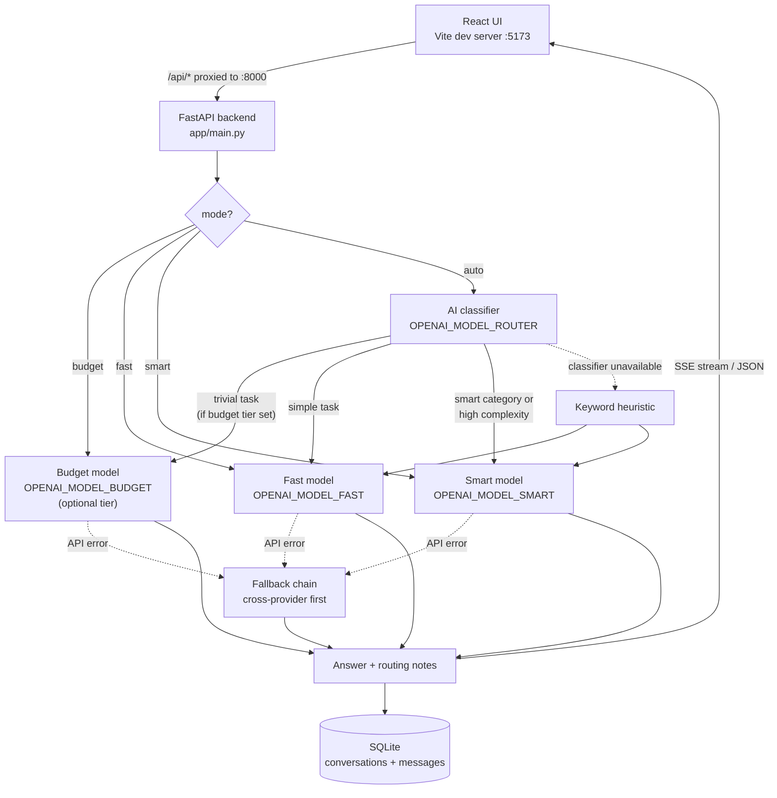

# AI Orchestrator

A local AI workbench that routes every request to the cheapest model that can handle it. A tiny classifier model looks at each question and dispatches it to a **fast** tier (quick facts, chat, summaries, reformatting) or a **smart** tier (coding, debugging, reasoning, planning, math, analysis) — so you stop paying flagship-model prices for questions a mini model answers just as well. Conversations are saved to SQLite with automatic titling, answers stream token-by-token over SSE, and a fallback chain keeps requests succeeding even when the primary model errors. A React UI sits on top; the whole thing runs on your machine with one API key.

## Architecture


```mermaid
flowchart TD
    UI["React UI<br/>Vite dev server :5173"] -- "/api/* proxied to :8000" --> API["FastAPI backend<br/>app/main.py"]
    API --> MODE{"mode?"}
    MODE -- "budget" --> BUD["Budget model<br/>OPENAI_MODEL_BUDGET<br/>(optional tier)"]
    MODE -- "fast" --> FAST["Fast model<br/>OPENAI_MODEL_FAST"]
    MODE -- "smart" --> SMART["Smart model<br/>OPENAI_MODEL_SMART"]
    MODE -- "auto" --> CLS["AI classifier<br/>OPENAI_MODEL_ROUTER"]
    CLS -- "trivial task<br/>(if budget tier set)" --> BUD
    CLS -- "simple task" --> FAST
    CLS -- "smart category or<br/>high complexity" --> SMART
    CLS -. "classifier unavailable" .-> HEUR["Keyword heuristic"]
    HEUR --> FAST
    HEUR --> SMART
    BUD -. "API error" .-> FB["Fallback chain<br/>cross-provider first"]
    FAST -. "API error" .-> FB
    SMART -. "API error" .-> FB
    BUD --> ANS["Answer + routing notes"]
    FAST --> ANS["Answer + routing notes"]
    SMART --> ANS
    FB --> ANS
    ANS --> DB[("SQLite<br/>conversations + messages")]
    ANS -- "SSE stream / JSON" --> UI
```

Request lifecycle for a conversation ask: the user message is persisted first, the last 12 messages are folded into a context prompt, the router picks a model, the answer streams back (or returns as JSON), and the assistant message is persisted with its routing metadata before the terminal event is sent.

## Features

74 features across routing, cost control, attachments, and conversation management — the full list with how/why each one works is in **[docs/features.md](docs/features.md)**. Headline names, grouped:

**Routing & providers:** AI-based routing · Task-based model selection · Optional budget tier · Zero-cost local models via Ollama · Multi-provider · Cross-vendor fallback chain · OpenAI-compatible `/v1/chat/completions`

**Tools & attachments:** Optional web search retrieval · Optional actions/webhooks (propose-then-confirm) · Optional moderation safety net · Optional fact-check lookup · Optional precision math (SymPy) · Optional image generation (OpenAI or Gemini/Imagen) · Optional code execution · Image input / vision · Automatic image cost reduction · Document input · Voice input · Voice output · Optional concise-answer mode

**Cost & budget:** Per-tier budgets · Cost & token tracking · Daily spend cap · Per-owner daily spend cap · Response caching · Optional semantic (paraphrase) caching · Usage dashboard · The efficiency KPI (tokens per $1) · Low-budget warning · Cost-visibility pass · Avoided-cost tracking · Live cost preview · Optional rate limiting · Optional self-updating model catalog

**Conversation management:** Conversation persistence + auto-titling · Long-conversation memory · Optional cross-conversation memory · Provider prompt caching · Regenerate / switch-model · Truncation detection + Continue · Ambiguity-triggered clarifying questions · Edit a past message · Draft auto-save · Delete a single message, with Undo · Bookmark a message · Bookmarks panel · Saved prompt templates · Export a conversation · Export all conversations · Import a conversation · Duplicate a conversation · Branch a conversation from a message · Summarize a conversation · Compare models · Search conversations · Sort the conversation list · Back to previous conversation · Deep-linkable conversations and messages · Message-count badge · Find in conversation · Jump to latest · Favorite conversations · Tag conversations · Archive a conversation · Delete a conversation, with Undo · Bulk archive/delete/export/tag conversations · Per-conversation model pin · Per-conversation custom instructions

**Auth & UX:** Optional auth + per-user data · Runtime-editable model map · Keyboard shortcuts · Light / dark theme toggle · Background reply notifications · Copy to clipboard · Onboarding hints for a fresh install · SSE streaming · Telemetry · OpenTelemetry tracing

## Quickstart

### One-click launch (Windows)

Once the backend venv and frontend `node_modules` are set up (see below), double-click **`start-app.bat`** (or the desktop shortcut it's paired with) to start both dev servers and open the UI in your browser in one go — it skips a server that's already running rather than erroring, so it's safe to double-click again. Each server gets its own visible console window (so logs stay visible and closing a window stops that server); **`stop-app.bat`** stops both by port instead, if you'd rather not hunt down the windows.

### Backend

```bash
python -m venv venv

# Windows
venv\Scripts\activate
# macOS / Linux
source venv/bin/activate

pip install -r requirements.txt          # runtime only
# or, for tests + linting:  pip install -r requirements-dev.txt

# Windows
copy .env.example .env
# macOS / Linux
cp .env.example .env
# then edit .env and set OPENAI_API_KEY

uvicorn app.main:app --reload --port 8000
```

### Frontend

```bash
cd frontend
npm install
npm run dev
```

Open <http://localhost:5173>. The Vite dev server proxies `/api/*` to the backend at `http://127.0.0.1:8000` (stripping the `/api` prefix), so no CORS setup is needed for local development.

The UI gives you a conversation sidebar (create / rename / delete), a mode picker (auto / fast / smart), live streaming answers with markdown rendering, dark mode, and an optional token field for when the backend runs with `API_AUTH_TOKEN` set.

### Or run the whole stack with Docker

```bash
cp .env.example .env   # add your OPENAI_API_KEY
docker compose up --build
```

This starts the backend (internal only — not published on the host, reachable only from the frontend container) and an nginx-served production build of the UI at <http://localhost:5173>; nginx proxies `/api` to the backend (streaming-safe, so SSE works), so the browser stays same-origin and no CORS config is needed. The SQLite DB persists in the `orchestrator-data` volume. Backend config comes from your `.env`. Keep the backend un-published: `TRUST_PROXY_HEADERS=true` (set for you in `docker-compose.yml`) makes the backend trust nginx's forwarded-IP header for rate limiting, which only holds if nginx is the only thing that can reach it directly.

> The Docker setup (`Dockerfile`, `frontend/Dockerfile`, `frontend/nginx.conf`, `docker-compose.yml`) is provided as-is and was not built in the authoring environment — `docker compose up --build` is the intended entry point.

> **Before exposing this beyond localhost**, set at least `API_AUTH_TOKEN` or `JWT_SECRET` — `.env.example` ships every safety net (auth, `RATE_LIMIT`, `DAILY_BUDGET_USD`) unset, which is the right default for a frictionless local run but not for an internet-facing one. The app logs a startup warning listing whichever of these are still off, so check your logs on first boot.

## Documentation

- **[docs/features.md](docs/features.md)** — every feature in detail: what it does, how to enable it, the design tradeoffs behind it.
- **[docs/configuration.md](docs/configuration.md)** — every environment variable, with defaults and what each one actually gates.
- **[docs/api-reference.md](docs/api-reference.md)** — every endpoint: method, path, body, response shape.
- **[docs/routing.md](docs/routing.md)** — how `auto` mode decides fast vs. smart, the classifier prompt, the keyword-heuristic fallback, and web search retrieval gating.
- **[docs/development.md](docs/development.md)** — running the test suites (backend/frontend/E2E), pre-commit hooks, type checking, database migrations, the project's file structure, and design notes (routing economics, accessibility conventions, mobile layout, frontend performance).

## License

MIT — see [LICENSE](LICENSE). © 2026 John-Paul Cremin.
