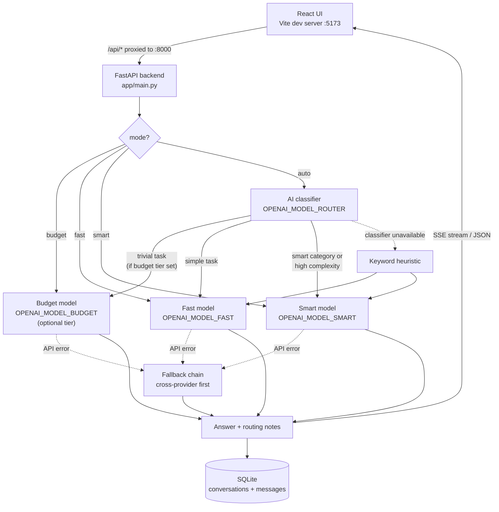

# AI Orchestrator

A local AI workbench that routes every request to the cheapest model that can handle it. A tiny classifier model looks at each question and dispatches it to a **fast** tier (quick facts, chat, summaries, reformatting) or a **smart** tier (coding, debugging, reasoning, planning, math, analysis) — so you stop paying flagship-model prices for questions a mini model answers just as well. Conversations are saved to SQLite with automatic titling, answers stream token-by-token over SSE, and a fallback chain keeps requests succeeding even when the primary model errors. A React UI sits on top; the whole thing runs on your machine with one API key.

## Architecture


```mermaid
flowchart TD
    UI["React UI<br/>Vite dev server :5173"] -- "/api/* proxied to :8000" --> API["FastAPI backend<br/>app/main.py"]
    API --> MODE{"mode?"}
    MODE -- "budget" --> BUD["Budget model<br/>OPENAI_MODEL_BUDGET<br/>(optional tier)"]
    MODE -- "fast" --> FAST["Fast model<br/>OPENAI_MODEL_FAST"]
    MODE -- "smart" --> SMART["Smart model<br/>OPENAI_MODEL_SMART"]
    MODE -- "auto" --> CLS["AI classifier<br/>OPENAI_MODEL_ROUTER"]
    CLS -- "trivial task<br/>(if budget tier set)" --> BUD
    CLS -- "simple task" --> FAST
    CLS -- "smart category or<br/>high complexity" --> SMART
    CLS -. "classifier unavailable" .-> HEUR["Keyword heuristic"]
    HEUR --> FAST
    HEUR --> SMART
    BUD -. "API error" .-> FB["Fallback chain<br/>cross-provider first"]
    FAST -. "API error" .-> FB
    SMART -. "API error" .-> FB
    BUD --> ANS["Answer + routing notes"]
    FAST --> ANS["Answer + routing notes"]
    SMART --> ANS
    FB --> ANS
    ANS --> DB[("SQLite<br/>conversations + messages")]
    ANS -- "SSE stream / JSON" --> UI
```

Request lifecycle for a conversation ask: the user message is persisted first, the last 12 messages are folded into a context prompt, the router picks a model, the answer streams back (or returns as JSON), and the assistant message is persisted with its routing metadata before the terminal event is sent.

## Features

- **AI-based routing** — a cheap classifier model (`OPENAI_MODEL_ROUTER`) categorises each request (via strict structured-output JSON, so it can't return an invalid category) and picks the tier; a keyword heuristic takes over if the classifier is unavailable, so `auto` mode never blocks on the router. A free pre-gate skips the classifier entirely for obvious prompts (a bare greeting → fast, a fenced code block → smart) so they answer instantly — each shortcut stands down only when the ONE category it would preempt (`casual_chat` for greetings; `coding`/`debugging` for a fenced code block) has its own override configured, not when some unrelated category does (`ROUTER_PREFILTER=false` to disable the pre-gate entirely).
- **Task-based model selection** — set `MODEL_<CATEGORY>` (e.g. `MODEL_CODING=claude-sonnet-5`, `MODEL_MATH=gemini/gemini-flash-latest`) and `auto` mode sends each task category to the model you've named best for it, across any provider. Unset categories fall back to the fast/smart tier; the tier still sets the token budget and reasoning effort.
- **Optional budget tier** — set `OPENAI_MODEL_BUDGET` (e.g. a cheap open-weight model via Groq/Together) and `auto` sends low-complexity fast-category tasks and bare greetings to it instead of the fast tier — with a tight token budget and minimal reasoning — so the cheapest slice of traffic gets the cheapest model. Opt-in (unset = routing unchanged); also selectable per request (`mode: "budget"`) or as a conversation pin, and it stretches the `DAILY_BUDGET_USD` cap further.
- **Zero-cost local models via Ollama** — point any tier at `ollama/<model>` (e.g. `OPENAI_MODEL_BUDGET=ollama/llama3.1:8b` with [Ollama](https://ollama.com) running locally; the `ollama_chat/` prefix works too) and that slice of traffic costs literally nothing: no API key, answers report `cost_usd: 0` (not "unpriced"), and free calls neither consume the `DAILY_BUDGET_USD` cap nor are ever blocked by it. If the local server turns out to be down, the normal paid fallback chain takes over — with each fallback candidate budget-gated individually, so a dead free primary can't route paid spend past an exhausted cap. Two deliberate exclusions: Ollama's `*-cloud` tags (proxied by the local daemon to Ollama's usage-metered paid cloud) are **not** auto-priced at $0 and stay "unpriced" unless you add a `MODEL_PRICING` entry; and an explicit `MODEL_PRICING` entry for any `ollama/` model always wins over the $0 default, for anyone accounting for local compute. Auth-style failures point at the local server ("is it running?") rather than a nonexistent API key. LiteLLM talks to `http://localhost:11434` by default; set `OLLAMA_API_BASE` for a non-default host.
- **Optional web search retrieval** — set `WEB_SEARCH=true` and `auto` mode grounds freshness-sensitive questions (news, prices, scores, weather, "latest"/"current" real-world events) in live results via the OpenAI Responses API's hosted `web_search` tool — no new key, it bills through your existing `OPENAI_API_KEY`. The classifier decides per-question (never fires for "the current file"/"the latest commit" — only real-world freshness), only ever engages when the resolved model is OpenAI-served, and returns citations as a `sources` field on the answer. A web-searched answer is never written to the response cache, so it can't go stale on replay.
- **Optional actions/webhooks (propose-then-confirm)** — set `ACTIONS_WEBHOOK_URL` (a Zapier "Catch Hook", Make "Webhooks" trigger, or any endpoint you control) and the model can *propose* a real-world action (send an email, add a row to a sheet, post a message) via a `pending_action` on the answer. Nothing ever fires automatically: the proposal is only executed after an explicit `POST /v1/conversations/{id}/messages/{id}/action {"confirm": true}` from the client, which then POSTs the model's payload to your fixed webhook URL — the destination is never chosen by the model. Only ever engages when the resolved model is OpenAI-served; a message with a pending action is never written to the response cache.
- **Optional image generation (OpenAI or Gemini/Imagen)** — set `IMAGE_GENERATION=true` and the model can generate images (e.g. "draw me a cat wearing a hat"). Two interchangeable backends picked by `IMAGE_GENERATION_MODEL`'s prefix, the same convention used for every other model setting in this app: the default `gpt-image-1` uses OpenAI's hosted `image_generation` tool (no new key, bills through `OPENAI_API_KEY`, the model itself decides when to call it); pointing it at `gemini/imagen-...` routes through LiteLLM and your existing `GEMINI_API_KEY` instead, triggered by a phrase heuristic since Gemini has no equivalent tool. Images come back as `images: ["data:image/png;base64,..."]` on the answer and persist with the message. Quality/size are configurable (`IMAGE_GENERATION_QUALITY`, default `high`; `IMAGE_GENERATION_SIZE`); a message with generated images is never written to the response cache.
- **Optional code execution** — set `CODE_EXECUTION=true` and the model can run Python via OpenAI's hosted `code_interpreter` tool to verify a calculation or test a snippet instead of reasoning its way to an answer it can't check — same trust boundary as web search/image generation: it runs in OpenAI's own sandboxed container, never on this machine. No new key, bills through `OPENAI_API_KEY`; only ever engages when the resolved model is OpenAI-served, and the model decides for itself when running code would help. Each call comes back as a `code_results: [{"code", "logs", "images"}]` entry on the answer (the code, its stdout, and any plot images) and persists with the message; a rough flat cost per call is added to the total (`CODE_EXECUTION_COST_USD`, default $0.03 — override for exact figures). A message with executed code is never written to the response cache. Each code block in the UI is collapsible and has its own 📋 copy button, the same one used for regular markdown code fences.
- **Image input / vision** — attach up to 4 images to a question (the 📎 button in the UI, pasting a screenshot directly into the question box from your clipboard, dragging a file onto the composer, or `images: [...]` on the request as `data:image/{png,jpeg,gif,webp};base64,...` URLs) and the resolved model sees them alongside the text — no opt-in flag, no new key, works across **every** provider (OpenAI, Anthropic/Claude, and any LiteLLM-routed model whose provider supports vision). Paste and drag-and-drop both go through the exact same validation/preview path as the 📎 picker (same 4-image cap, same skip-status messaging, and — since the drop target also accepts documents — the same PDF/plain-text handling as Document input below); the composer highlights while something's dragged over it. A copied screenshot has no text representation, so pasting one never interferes with a normal text paste. Attached images persist with the user's message and are reused automatically on regenerate. A request with attached images is never served from or written to the response cache.
- **Document input** — attach up to 4 PDF or plain-text documents to a question (the same 📎 button, dragging a file onto the composer, or `files: [{"filename", "data"}]` on the request) and the resolved model reads them alongside the text — same no-opt-in, every-provider design as vision, each translated into that API's own document/file content block (OpenAI's `input_file`, Anthropic's `document` block, LiteLLM's `file` block). Attached files persist with the user's message and are reused automatically on regenerate. A request with attached files is never served from or written to the response cache.
- **Voice input** — click the 🎤 button to record a question instead of typing it; the clip is transcribed via `POST /v1/transcribe` (OpenAI's transcription API, `TRANSCRIPTION_MODEL`, default `gpt-4o-mini-transcribe`) and the text is inserted into the question box for you to review and send. A discrete, explicitly user-triggered action rather than something threaded through the routing/fallback machinery — a failure returns a real HTTP error, not a 200 with an empty answer.
- **Voice output** — click the 🔊 button on any assistant message to hear it read aloud, via `POST /v1/speak` (OpenAI's TTS API, `SPEECH_MODEL`/`SPEECH_VOICE`, defaults `gpt-4o-mini-tts`/`alloy`); click again (now ⏹) to stop. Same discrete, user-triggered design as voice input — a real HTTP error on failure, no routing/fallback story to it.
- **Runtime-editable model map** — a **Settings** panel (and the `/v1/settings` API) lets you re-point any tier or task category to a different model live, without restarting: a saved value overrides the matching env var, and clearing it reverts to the env/default. The panel shows each category's effective model, where it came from (override / env / default), and warns when a chosen model's credential isn't set. Global map; set `ALLOW_SETTINGS_WRITE=false` to make it read-only on shared deployments. The same panel's **Optional features** section covers the cost-affecting tool flags (`WEB_SEARCH`, `IMAGE_GENERATION`, `CODE_EXECUTION`) as live checkboxes — the same override > env > default chain as a model tier, so turning one off mid-session needs no `.env` edit or restart. **⬇️ Export config**/**⬆️ Import config** back up and restore just the overrides (not env vars or defaults) as one JSON file — client-side, looping the existing single-key `PUT`/`GET` endpoints like the conversation bulk actions, so one bad key on import doesn't block the rest ("Imported 2 of 3 overrides (1 failed)."). Export stays available even when the server is read-only; import is disabled along with every other edit in that case.
- **Multi-provider** — any tier (`OPENAI_MODEL_FAST` / `_SMART` / `_FALLBACK`) can point at an OpenAI model, a Claude model (any name starting with `claude`), or any **LiteLLM** provider-prefixed model (`gemini/…`, `bedrock/…`, `mistral/…`, `groq/…`, and 100+ others). OpenAI goes through the native Responses API and Anthropic through the native Messages API; everything else is dispatched through LiteLLM. Set that provider's standard credential (`GEMINI_API_KEY`, `MISTRAL_API_KEY`, AWS creds for Bedrock, …). The `auto` router itself stays on OpenAI.
- **Cross-vendor fallback chain** — if the primary model call fails, the orchestrator retries through `OPENAI_MODEL_FALLBACK`, then `OPENAI_MODEL_FAST`, then `OPENAI_MODEL` (duplicates and the failed model removed), tagging the result `->fallback`. Candidates on a **different provider** are tried first, so pointing `OPENAI_MODEL_FALLBACK` at e.g. `claude-sonnet-5` survives a whole-provider OpenAI outage. Rate-limit / quota (429) errors fail over too, but **only cross-provider** — the same throttled key would just be rejected again.
- **SSE streaming** — answers stream incrementally over `text/event-stream` with a strict `meta` / `delta` / `done` / `error` event contract.
- **Conversation persistence + auto-titling** — conversations and messages live in SQLite; the first question of a generically-titled conversation becomes its title (trimmed to 70 chars).
- **Long-conversation memory** — the recent 12 turns are sent verbatim and everything older is folded into a compact summary (one cheap `OPENAI_MODEL_ROUTER` call), so long threads keep their whole context instead of forgetting anything past the window. The summary is cached per conversation and only the newly-aged-out turns are folded into it each time — so the summarizer call stays cheap as a thread grows, instead of re-summarizing the whole older history from scratch on every single answer. Short threads (≤ 12 prior messages) are untouched and make no extra call; turn it off with `SUMMARIZE_HISTORY=false`.
- **Optional auth + per-user data** — a static bearer token (`API_AUTH_TOKEN`) and/or username/password accounts with JWTs (`JWT_SECRET` + `/v1/auth/register` & `/v1/auth/login`, with a login/logout UI); either credential grants access, and both are off by default for a zero-friction local setup. When a user is logged in via JWT, their conversations are private to them; with auth off (or a static token) conversations live in a shared bucket, so existing setups are unchanged. JWTs carry a `jti` + a per-user session epoch, so `/v1/auth/logout` **revokes every one of a user's tokens at once** (losing both API access and conversation ownership at one chokepoint), and `/v1/auth/refresh` issues a fresh token while rotating out (revoking) the old one. Every authenticated request in the UI goes through one `authFetch` wrapper, which tells apart the two different reasons an action can 401 and messages each accordingly instead of every action surfacing its own generic "Failed to X": a token that used to work getting rejected (expired, or revoked from another tab) signs out locally and shows "Session expired — please sign in again."; there never having been a token at all (auth is required but nobody's logged in yet — the sign-in form lives in the sidebar footer, easy to miss since the main chat UI stays fully visible either way) shows "Log in to do this" instead, with no sign-out needed since there was no session to lose.
- **Optional rate limiting** — set `RATE_LIMIT` (e.g. `60/minute`) to throttle the ask endpoints per client IP; unset leaves them unthrottled. The auth endpoints (`register`/`login`/`logout`/`refresh`) have their own limiter that's **always on** regardless of `RATE_LIMIT` (`AUTH_RATE_LIMIT`, default `5/minute`) — closing off brute-force/registration-spam by default rather than requiring opt-in. When the ask/regenerate/edit endpoints do throttle a request (429), the UI shows a clear "You're sending requests too fast" status instead of a bare "Request failed (429)", and restores the question text so nothing typed is lost.
- **Per-tier budgets** — separate max-output-token limits and reasoning-effort levels for the fast and smart tiers, so quick answers stay quick and hard problems get room to think.
- **Cost & token tracking** — every answer reports input/output tokens and an estimated USD cost (per built-in, overridable price list; prompt tokens the provider served from its own cache are billed at the discounted cached rate), shown per message and as a running per-conversation total in the UI — so the savings from routing cheap tasks to cheap models are visible.
- **Daily spend cap** — set `DAILY_BUDGET_USD` and, once the next call's worst-case cost would push today's total (across all users, per UTC day) past the limit, the call is refused before any model runs. The check reserves that worst-case cost atomically as part of the same check (not a separate later write), so multiple concurrent calls can't each pass the same stale total and jointly overshoot the cap; the reservation is reconciled down to the call's real cost once it completes, or released if it never dispatched. Every billable call is counted in a durable spend log — including empty/truncated reasoning calls that aren't saved as messages, and `/v1/speak`/`/v1/transcribe` (priced by a flat/per-character estimate, since neither bills per LLM token). `/v1/status` reports only whether a cap is active; the live figures stay off the public endpoint.
- **Per-owner daily spend cap** — set `DAILY_BUDGET_PER_OWNER_USD` for the same kill-switch scoped to one caller's own spend (see `spend_log`'s `owner` column) instead of everyone's combined total, so one user maxing out their own budget doesn't starve everyone else's, and vice versa. Independent of `DAILY_BUDGET_USD`: either, both, or neither can be set, and both are checked atomically in the same reservation when both are configured — whichever is hit first refuses the call. Applies to the shared/unowned bucket too (static-token or no-auth deployments), where it's simply redundant with the global cap unless set tighter than it.
- **Response caching** — an identical prompt (same mode + model config) returns instantly and for free, with no model call — not even the classifier. The cache key folds in a signature of the model map, so editing a tier/category or a routing env var auto-invalidates stale entries; TTL and max-entry eviction are configurable, cached answers are badged in the UI, and `no_cache` on a request forces a fresh answer.
- **Regenerate / switch-model** — re-run a conversation's last answer (always fresh, bypassing the cache), optionally forcing a specific model or tier instead of the routed one. The old answer is replaced in place. A forced model bypasses the classifier and the cache entirely.
- **Truncation detection + Continue** — when a provider stops an answer early because it hit `max_output_tokens` (OpenAI's `status: "incomplete"`, Anthropic's `stop_reason: "max_tokens"`, or a LiteLLM provider's `finish_reason: "length"`), the UI shows a "⚠️ Response was cut off" notice with a **Continue** button instead of silently showing a truncated answer. Continue (`POST /v1/conversations/{id}/messages/{message_id}/continue`) asks the model to resume exactly where it left off and appends the result to the same message — tokens/cost accumulate across every continuation, so the total reflects everything spent producing the full answer. Non-streaming by design: a continuation is an occasional follow-up action, not the primary answering path, so a second streaming implementation wasn't worth the added surface.
- **Ambiguity-triggered clarifying questions** — the router's classifier call (already made once per `auto` request to pick a tier) also checks whether the new message references something ambiguous in the last few turns (e.g. "this"/"it" could mean either of two things just discussed). When it does, the orchestrator returns a clarifying question directly instead of guessing and calling a fast/smart model — no new LLM call, and cheaper than the alternative of burning a full answer on the wrong interpretation. Auto mode only; explicit fast/smart/budget modes skip the classifier entirely, same as today.
- **Edit a past message** — click ✏️ on any user message to edit its text and resend it; everything from that turn onward (the old answer, and any later turns) is discarded and a fresh answer is generated from that point. Attachments (images/files) on the edited turn carry over unchanged — only the text is editable. A failed or aborted edit leaves the original message and its answer untouched, the same "replace only on success" safety net as regenerate.
- **Draft auto-save** — an unsent question is saved per conversation (client-side, in `localStorage`) as you type, so switching conversations or reloading the page never silently discards it — and, just as important, never leaves it sitting in a different conversation's composer where it could get sent to the wrong thread. Cleared once the question is actually sent.
- **Delete a single message, with Undo** — click 🗑️ on any message to remove just that one message, whatever its role, without touching anything else in the conversation — distinct from regenerate (replaces the last answer) and edit (discards everything from a point onward and re-asks). Asks for confirmation first, then offers an 8-second "Undo" the same way deleting a whole conversation does. Restoring a single message can't reuse Import (that always builds a whole new conversation), so it goes through a dedicated `POST /v1/conversations/{id}/messages/restore` instead — recreates the message (fresh id, no model call) in its *existing* conversation from the client-side snapshot taken right before the delete, same fidelity/limitations as Import (attachments excepted).
- **Bookmark a message** — click 🏷️/🔖 on any message (either role) to mark just that one turn (`PUT /v1/conversations/{id}/messages/{message_id}/bookmark`), distinct from favoriting the whole conversation. A pure marker like favorite/archive — doesn't touch the conversation's `updated_at`, and persists across reloads.
- **Bookmarks panel** — the **Bookmarks** button in the chat header (`GET /v1/bookmarks`) lists every message you've bookmarked across *every* conversation, newest first, each with a snippet and its parent conversation's title — reviewing what you bookmarked no longer means hunting back through each conversation individually. Clicking a row jumps straight to that conversation, the same "select and close" pattern as a sidebar search result. A 🏷️ button on each row unbookmarks it right there (the same `PUT .../bookmark` toggle the message view uses) without needing to open that conversation first. **⬇️ Export** downloads the full list as one Markdown file (conversation title, timestamp, and full content per bookmark) — entirely client-side, built from what's already loaded, and disabled when there's nothing to export. Owner-scoped like every other conversation-derived endpoint.
- **Keyboard shortcuts** — `Ctrl+K` / `⌘K` jumps into the conversation search box from anywhere. `Alt+N` / `⌥N` starts a new conversation and focuses the composer, ready to type — `Ctrl+N`/`⌘N` is deliberately not used, since browsers reserve it for "new window" and page JavaScript can't intercept it. `Escape` backs out of whatever's open, most-local first: the Instructions panel, an in-progress message edit, then an active search — it never interferes with the Settings/Usage modals, which already close on their own `Escape` handler. Press `?` (or click the ❓ button next to the theme toggle) for a help modal listing all of these — suppressed while typing in the composer or any other text field, so a literal "?" in a question never pops it open. With a conversation row focused in the sidebar, `↑`/`↓` move to the previous/next conversation and `Home`/`End` jump to the first/last, like a standard listbox — scoped to that one row's focus, not a global handler, so it never fires while typing or interacting elsewhere.
- **Light / dark theme toggle** — the 🖥️/☀️/🌙 button at the top of the sidebar cycles System → Light → Dark → System. System (the default, and the only behavior before this toggle existed) follows the OS's `prefers-color-scheme`; an explicit Light or Dark choice overrides it regardless of the OS setting, and persists in the browser's `localStorage` (client-side only — no account setting, no server round-trip).
- **Background reply notifications** — the 🔕/🔔 button next to the theme toggle opts into being told when an answer finishes while this tab isn't the one you're looking at: the tab title flashes to "💬 New reply" (reverting the moment you switch back), and, if you grant the browser's Notification permission, a native OS notification pops up too, click-to-focus straight into that conversation. Off by default, and only ever fires for the tab that's actually hidden — permission is requested once, right when you turn it on, never on page load unprompted. Once notifications are on, a second 🔈/🔊 toggle appears for an audible cue — a short beep synthesized on the spot via the Web Audio API, so there's no audio asset file or new dependency. Entirely client-side (`localStorage`), no new endpoint.
- **Export a conversation** — the ⬇️ Export control in the chat header downloads the current conversation as Markdown (human-readable, with sources linked and attachment counts noted) or JSON (the full raw message data, including attachment content), opens it as a print-ready **PDF (print)** document in a new tab and hands off to the browser's native print dialog, or **📋 Copy as Markdown** puts the same Markdown straight on the clipboard — no file to save and reopen, just paste into Slack/a doc/an email. All four are entirely client-side — no server round-trip, since the messages are already loaded in the UI.
- **Export all conversations** — the **⬇️ Export all** button in the sidebar backs up every conversation (including archived ones) as one JSON file: `{"exported_at", "conversations": [{"conversation", "messages"}, ...]}`, each entry in the same shape a single-conversation JSON export produces — so any one of them can be pulled out and re-imported individually via `POST /v1/conversations/import`. Fetches each conversation's messages client-side (one request per conversation); no dedicated backend endpoint.
- **Import a conversation** — the **⬆️ Import conversation** control in the sidebar re-creates a conversation from a JSON file previously produced by Export (`POST /v1/conversations/import`): a fresh conversation with new message ids, no model calls involved. Everything Duplicate also copies comes back too — the model pin, custom instructions, tags, and each message's tokens/cost/cached flag/sources/truncated flag/code_results — since none of it is a binary blob. Attachments (images/files) are the one exception and are never restored: re-validating/re-storing arbitrary base64 blobs from an uploaded file isn't a risk worth taking for this backup/restore convenience. It also accepts a whole **⬇️ Export all** bundle in one drop, restoring every conversation in it (best-effort: one bad entry doesn't abort the rest — the status line reports how many succeeded).
- **Duplicate a conversation** — the **Duplicate** button in the chat header (`POST /v1/conversations/{id}/duplicate`) copies the current conversation — title (suffixed " (copy)"), pin, custom instructions, and every message with full fidelity (attachments, cost, tokens, truncated flag, code_results) — into a brand-new one, so you can branch off and try a different approach without losing the original. A server-side DB-to-DB copy, unlike import, so attachments round-trip intact; any pending action is deliberately not carried over, since confirming it on the copy would re-fire the same webhook a second time.
- **Compare models** — the **Compare** panel (`POST /v1/compare`) asks the same question of 2–4 specific models side-by-side and reports each answer alongside its cost, tokens, and latency — a direct, standalone way to see what multi-provider routing is actually trading off, independent of any saved conversation. Pick from your configured tier models, or type any model name into the "Add a specific model" field (e.g. `groq/llama-3.3-70b-versatile`) — useful right after adding a new provider key. Dispatched one model at a time (not in parallel), so the daily-budget accounting across the batch stays correct; one model being unconfigured or failing never aborts the rest of the comparison, since it's reported as an empty answer + explanatory notes rather than an error.
- **Copy to clipboard** — a 📋 button on every message copies its full text (via the browser's Clipboard API); fenced code blocks in assistant answers get their own **Copy** button so a snippet can be grabbed without the surrounding prose. Both flip to a brief "copied" confirmation on success; a failure (e.g. clipboard permission denied) surfaces a status message rather than failing silently.
- **Search conversations** — the sidebar search box (`GET /v1/search?q=...`) matches against both conversation titles and message content, so an old conversation is findable even if its auto-generated title doesn't mention what you're looking for. Debounced client-side; results show a matching snippet, with every occurrence of the search term highlighted in the title and snippet so you can see exactly what matched, and jump straight to that conversation on click. Owner-scoped like every other conversation endpoint — a search only ever surfaces your own conversations.
- **Sort the conversation list** — a **Sort** dropdown in the sidebar switches between the default **Recent** order (favorited conversations first, then most-recently-updated — exactly what the backend already returns) and **Name (A-Z)**, an alternate alphabetical view rather than an extra grouping layered on top. Purely client-side; combines with the tag and Favorites-only filters, which narrow the list before this re-orders it.
- **Back to previous conversation** — a **← Back to "..."** button appears in the sidebar once you've switched conversations at least once, taking you straight back to whichever one you were just in. Clicking it flips the two, Alt+Tab-style, so a second click returns you to where you started — no history stack, just the single last-selected id. Only shown while that conversation still exists (it disappears if it's since been deleted) and works even if the current tag/favorites filter would otherwise hide it from the visible list, since it's restoring a known conversation rather than browsing the filtered one.
- **Message-count badge** — each sidebar row shows a small badge with its message count (`GET /v1/conversations` now returns `message_count` via a correlated subquery, since `messages(conversation_id)` is already indexed). Hidden entirely for a conversation with no messages yet, rather than showing a "0" — a quick-glance signal for which conversations actually have content versus which were just created.
- **Onboarding hints for a fresh install** — with zero conversations and none selected, the main panel replaces the terse "Create or select a conversation" placeholder with a short welcome message and concrete first steps (create a conversation, ask a question, add provider API keys in Settings). Reverts to the plain placeholder as soon as at least one conversation exists, so it never talks down to a returning user.
- **Find in conversation** — the **🔎 Find** button in the chat header opens an inline find bar that searches just the open conversation's messages, cycling between matches (a match counter, ↑/↓ prev/next, Enter/Shift+Enter) and highlighting + scrolling to the active one. Distinct from sidebar search, which finds a *conversation* but doesn't scroll to or highlight anything inside it once it's open. Entirely client-side, no request — the messages are already loaded.
- **Jump to latest** — a floating button appears once you've scrolled away from the bottom of a long conversation, jumping straight back to the newest message on click. The whole page scrolls in this layout (nothing bounds the message list to the viewport), so this — and the existing "follow the tail while streaming" behavior — is measured off the page's own scroll position, not an inner pane; the button itself is fixed to the viewport for the same reason, or it would scroll out of view along with everything else.
- **Favorite conversations** — click the ☆/★ toggle next to any conversation in the sidebar (`PUT /v1/conversations/{id}/favorite`) to pin it to the top of the list, ahead of everything unfavorited; within each group, conversations still sort by most-recently-updated. A pure bookmark — starring doesn't touch `updated_at` or otherwise affect routing/caching. Carries over on Duplicate and Export/Import, the same field parity as the model pin and custom instructions. Check **★ Favorites only** in the sidebar to narrow the list down to just your starred conversations — a client-side filter, same as the tag filter, and combines with it (both narrow the same list at once).
- **Tag conversations** — the **Tags** button in the chat header (`PUT /v1/conversations/{id}/tags`) sets a comma-separated list of freeform labels on a conversation (trimmed, deduped, capped at 15 tags of 30 characters each), shown as chips in the sidebar. A **Filter conversations by tag** dropdown appears once any conversation has a tag, narrowing the sidebar list client-side. A pure organizational marker like favorite/archive — doesn't touch `updated_at` — and carries over on Duplicate/Import, the same field parity as the model pin/instructions/favorite.
- **Archive a conversation** — the **Archive** button in the chat header (`PUT /v1/conversations/{id}/archive`) hides a conversation from the default sidebar list without deleting it — a softer, reversible alternative to Delete. Check **Show archived** in the sidebar to see and select archived conversations (tagged "(archived)"); the button then reads **Unarchive** to restore one. Archiving doesn't touch `updated_at`, and the conversation itself stays fully reachable (messages, ask, etc.) while hidden — it's a visibility filter, not a lock. Unlike the model pin/instructions/favorite, archived status is deliberately NOT carried over by Duplicate or Import, since both produce a fresh working copy you'd want to actually see.
- **Delete a conversation, with Undo** — the **Delete** button in the chat header (after a confirmation prompt) permanently removes a conversation and its messages (`DELETE /v1/conversations/{id}`). Deleting is real and immediate — there's no soft-delete/trash table — but for the next 8 seconds a "Deleted "..." Undo" banner offers one click to bring it back, restored via the same `POST /v1/conversations/import` a JSON re-import uses (fresh id, same title/pin/instructions/favorite/tags/messages — attachments excepted, the one Import can't restore) built from a snapshot taken client-side right before the delete fires. An emptied conversation (no messages) restores via a plain create instead, since Import requires at least one message. Purely a convenience for "oops, wrong conversation" — not a substitute for Export as an actual backup.
- **Bulk archive/delete/export/tag conversations** — the **Select** button in the sidebar turns every conversation row into a checkbox; pick as many as you like, then **Archive selected**, **Delete selected**, **Export selected**, or **Add tag** to act on just that batch instead of one conversation at a time (or all of them, via Export all). Archive/delete/tag are best-effort like Export all/bulk import: each conversation is acted on individually via the same single-item endpoints, so one failure never blocks the rest — the status line reports the split (e.g. "Archived 2 of 3 conversations (1 failed)."). Export selected produces the same Export-all-shaped JSON bundle, just scoped to the checked conversations. Add tag *merges* the new tag into each conversation's existing tags rather than replacing them, since the underlying endpoint sets tags wholesale. Bulk delete asks for one confirmation covering the whole batch, not one per conversation.
- **Usage dashboard** — the **Usage** panel in the chat header (`GET /v1/usage?days=`) reads back your own slice of the same `spend_log` ledger that backs the daily budget cap: today's total, a by-day bar chart, and a by-model breakdown (calls, tokens, cost) over a selectable 7/14/30/90-day window. Owner-scoped — you only ever see your own spend, never the deployment-wide total (that stays off the public `/v1/status`). When `DAILY_BUDGET_PER_OWNER_USD` is set, it also shows how much of *your own* cap is left today (e.g. "$0.65 left of your $1.00 daily cap"); with only `DAILY_BUDGET_USD` set, it shows that configured limit as context. Either way, only the configured limit(s) are exposed here — never the live global spend total, which stays private to the operator. The **⬇️ Export CSV** button downloads the currently-shown window's daily spend and by-model breakdown as one CSV file — entirely client-side, built from data already fetched for the panel, no extra request.
- **Low-budget warning** — once your own remaining room under `DAILY_BUDGET_PER_OWNER_USD` drops to 15% or less of the cap, a small warning banner appears above the composer (e.g. "⚠️ Only $0.10 left of your $1.00 daily budget today.") — checked on page load and again after every answer, so it stays current without opening the Usage panel. Silent when no per-owner cap is configured. Reuses the same `/v1/usage` endpoint and the same owner-scoped privacy boundary — it only ever surfaces the caller's own room, never the live global spend.
- **Per-conversation model pin** — pin a specific model (or the `budget`/`fast`/`smart` tier) to a conversation so every new question in it uses that model, bypassing the router. A pinned model routes like switch-model (no classifier, no cache); clear the pin to return to normal per-mode routing. The `budget` option only appears (in the mode selector, the pin selector, and the regenerate-with menu) once `OPENAI_MODEL_BUDGET` is configured server-side.
- **Per-conversation custom instructions** — the **Instructions** panel in the chat header (`PUT /v1/conversations/{id}/system_prompt`) lets you set a persona/style/rules block (e.g. "Always answer in French") that's prepended to every question asked in that conversation — including the very first one, and every regenerate/edit. Cleared with an empty value; a filled dot on the Instructions button shows when one is active, so its effect is never invisible. Capped at 4,000 characters.
- **Telemetry** — every request gets a UUID request id and elapsed-ms timing, surfaced in the response `notes` and in structured logs.
- **OpenTelemetry tracing** — set `OTEL_EXPORTER_OTLP_ENDPOINT` to export request spans (enriched with the routing decision) to any OTLP collector — SigNoz, Grafana Tempo, Jaeger, etc. Off by default, zero overhead when unset.

## Quickstart

### One-click launch (Windows)

Once the backend venv and frontend `node_modules` are set up (see below), double-click **`start-app.bat`** (or the desktop shortcut it's paired with) to start both dev servers and open the UI in your browser in one go — it skips a server that's already running rather than erroring, so it's safe to double-click again. Each server gets its own visible console window (so logs stay visible and closing a window stops that server); **`stop-app.bat`** stops both by port instead, if you'd rather not hunt down the windows.

### Backend

```bash
python -m venv venv

# Windows
venv\Scripts\activate
# macOS / Linux
source venv/bin/activate

pip install -r requirements.txt          # runtime only
# or, for tests + linting:  pip install -r requirements-dev.txt

# Windows
copy .env.example .env
# macOS / Linux
cp .env.example .env
# then edit .env and set OPENAI_API_KEY

uvicorn app.main:app --reload --port 8000
```

### Frontend

```bash
cd frontend
npm install
npm run dev
```

Open <http://localhost:5173>. The Vite dev server proxies `/api/*` to the backend at `http://127.0.0.1:8000` (stripping the `/api` prefix), so no CORS setup is needed for local development.

The UI gives you a conversation sidebar (create / rename / delete), a mode picker (auto / fast / smart), live streaming answers with markdown rendering, dark mode, and an optional token field for when the backend runs with `API_AUTH_TOKEN` set.

### Or run the whole stack with Docker

```bash
cp .env.example .env   # add your OPENAI_API_KEY
docker compose up --build
```

This starts the backend (internal only — not published on the host, reachable only from the frontend container) and an nginx-served production build of the UI at <http://localhost:5173>; nginx proxies `/api` to the backend (streaming-safe, so SSE works), so the browser stays same-origin and no CORS config is needed. The SQLite DB persists in the `orchestrator-data` volume. Backend config comes from your `.env`. Keep the backend un-published: `TRUST_PROXY_HEADERS=true` (set for you in `docker-compose.yml`) makes the backend trust nginx's forwarded-IP header for rate limiting, which only holds if nginx is the only thing that can reach it directly.

> The Docker setup (`Dockerfile`, `frontend/Dockerfile`, `frontend/nginx.conf`, `docker-compose.yml`) is provided as-is and was not built in the authoring environment — `docker compose up --build` is the intended entry point.

> **Before exposing this beyond localhost**, set at least `API_AUTH_TOKEN` or `JWT_SECRET` — `.env.example` ships every safety net (auth, `RATE_LIMIT`, `DAILY_BUDGET_USD`) unset, which is the right default for a frictionless local run but not for an internet-facing one. The app logs a startup warning listing whichever of these are still off, so check your logs on first boot.

## Configuration

All configuration is via environment variables, loaded from `.env` (gitignored — copy `.env.example` and fill in your key).

| Variable | Default | Purpose |
| --- | --- | --- |
| `OPENAI_API_KEY` | — (required) | Your OpenAI API key. Validated on the first ask; if it is missing, ask calls return an empty answer with an explanatory `notes` instead of raising. Required even when answering with Claude, because the `auto` router uses an OpenAI classifier. |
| `ANTHROPIC_API_KEY` | unset | Only needed if a tier points at a Claude model. |
| `GEMINI_API_KEY` / `MISTRAL_API_KEY` / `GROQ_API_KEY` / AWS creds / … | unset | Only needed if a tier points at that LiteLLM provider (`gemini/…`, `mistral/…`, `bedrock/…`, …). Bedrock also needs `pip install boto3`. |
| `OPENAI_MODEL` | `gpt-5` | Base/default model. Used when a tier variable below is unset, and as the last entry in the failure fallback chain. |
| `OPENAI_MODEL_ROUTER` | `gpt-5-nano` | Cheap classifier used in `auto` mode to pick a tier. Keep this small — it runs on every auto request. |
| `ROUTER_PREFILTER` | `true` | Skip the classifier for obvious prompts (bare greeting → fast, fenced code → smart). Each shortcut stands down only when the specific category it would preempt has its own override set (`MODEL_CASUAL_CHAT` for greetings; `MODEL_CODING`/`MODEL_DEBUGGING` for fenced code) — an override on an unrelated category doesn't affect it. `false` always classifies. |
| `OPENAI_MODEL_BUDGET` | unset | Optional cheapest tier below fast, for bulk/low-stakes work. When set, `auto` routes low-complexity fast-category tasks (and bare greetings) here; also usable via `mode: "budget"` or a pin. Unset = disabled. |
| `OPENAI_MODEL_FAST` | `gpt-5-mini` | Fast tier: quick facts, chat, summaries, reformatting. |
| `OPENAI_MODEL_SMART` | `gpt-5` | Smart tier: coding, debugging, reasoning, planning, math, analysis, creative writing. |
| `OPENAI_MODEL_FALLBACK` | `gpt-5-mini` | First fallback when the primary fails. Point it at a different provider (e.g. `claude-sonnet-5`) for true resilience — cross-provider candidates are tried first, and rate-limit (429) failover uses cross-provider only. |
| `BUDGET_MAX_OUTPUT_TOKENS` | `800` | Output-token cap for the budget tier (applies only when `OPENAI_MODEL_BUDGET` is set). |
| `FAST_MAX_OUTPUT_TOKENS` | `1500` | Output-token cap for the fast tier. Includes model reasoning tokens, so leave headroom. |
| `SMART_MAX_OUTPUT_TOKENS` | `4000` | Output-token cap for the smart tier. |
| `MODEL_PRICING` | built-in | JSON map of `{"model": [usd_per_1M_input, usd_per_1M_output]}` (or a 3rd value for the cached-input rate) to override/extend the built-in (approximate) price list used for cost estimates. |
| `DAILY_BUDGET_USD` | unset | Global daily spend cap in USD (across all users, per UTC day). Once the next call's worst-case cost would exceed it, the call is refused before dispatch. Unset / `0` disables the cap. |
| `DAILY_BUDGET_PER_OWNER_USD` | unset | Daily spend cap in USD scoped to one caller's own spend, independent of `DAILY_BUDGET_USD`. Checked atomically alongside the global cap when both are set. Unset / `0` disables it. |
| `WEB_SEARCH` | `false` | Ground freshness-sensitive `auto`-mode answers in live web results via OpenAI's hosted `web_search` tool (no new key — bills through `OPENAI_API_KEY`). Only engages for a resolved OpenAI-served model. |
| `ACTIONS_WEBHOOK_URL` | unset | Enables the propose-then-confirm actions/webhooks feature. The model may propose an action; only an explicit client confirm POSTs the payload to this fixed URL (a Zapier/Make webhook, or your own). Unset = the feature is never offered to the model. |
| `IMAGE_GENERATION` | `false` | Enables image generation (either backend, see `IMAGE_GENERATION_MODEL`). |
| `IMAGE_GENERATION_MODEL` | `gpt-image-1` | A bare name (e.g. `gpt-image-1`) uses OpenAI's hosted tool, model decides when to call it; a `gemini/...`-prefixed name (e.g. `gemini/imagen-4.0-generate-001`) routes through LiteLLM/`GEMINI_API_KEY` instead, gated by a phrase heuristic on the question. |
| `IMAGE_GENERATION_QUALITY` | `high` | `low`\|`medium`\|`high`\|`auto` for generated images. Default favors quality; lower it for a cost-sensitive deployment. OpenAI-only — Gemini has no quality param and ignores this. |
| `IMAGE_GENERATION_SIZE` | `auto` | Generated image size/aspect ratio (`auto`, `1024x1024`, `1024x1536`, `1536x1024`, or a model-specific custom size). |
| `IMAGE_GENERATION_COST_USD` | unset | Approximate USD cost per generated image, added to the answer's `cost_usd` and the spend log. Unset uses a rough per-quality estimate. |
| `CODE_EXECUTION` | `false` | Enables the `code_interpreter` tool — the model can run Python in OpenAI's own sandboxed container (never on this machine) to verify a calculation or test a snippet. Only engages for a resolved OpenAI-served model; the model decides for itself when to use it. |
| `CODE_EXECUTION_COST_USD` | `0.03` | Approximate flat USD cost per `code_interpreter` call, added to the answer's `cost_usd` and the spend log. Not token-based, so it can't come from the model pricing table — override for exact figures. |
| `TRANSCRIPTION_MODEL` | `gpt-4o-mini-transcribe` | The model `POST /v1/transcribe` (voice input) uses. `gpt-4o-transcribe` for higher quality, or `whisper-1` for the classic model. |
| `TRANSCRIPTION_COST_PER_CALL_USD` | `0.006` | Flat estimated USD cost per `/v1/transcribe` call, used to gate it against `DAILY_BUDGET_USD` and to record it in the spend log. Whisper-class transcription bills per minute of audio, which isn't known before decoding the clip, so this is a rough flat estimate rather than an exact per-minute rate. |
| `SPEECH_MODEL` | `gpt-4o-mini-tts` | The model `POST /v1/speak` (voice output) uses. `tts-1-hd` for higher quality. |
| `SPEECH_VOICE` | `alloy` | The TTS voice; see OpenAI's [Text to speech guide](https://platform.openai.com/docs/guides/text-to-speech#voice-options) for the full list. |
| `SPEECH_COST_PER_1K_CHARS_USD` | `0.015` | Estimated USD cost per 1,000 input characters for `/v1/speak`, used to gate it against `DAILY_BUDGET_USD` and to record it in the spend log. OpenAI TTS bills per character, not per LLM token. |
| `CACHED_INPUT_MULTIPLIER` | `0.1` | Prompt tokens the provider served from its own cache are billed at the model's cached rate, or — if none is set — at the input rate × this. |
| `BUDGET_REASONING_EFFORT` | `minimal` | Reasoning effort for the budget tier (applies only when `OPENAI_MODEL_BUDGET` is set). |
| `FAST_REASONING_EFFORT` | `low` | Reasoning effort requested from the fast-tier model. |
| `SMART_REASONING_EFFORT` | `medium` | Reasoning effort requested from the smart-tier model. |
| `MODEL_<CATEGORY>` | unset | Per-task-category model override for `auto` mode, e.g. `MODEL_CODING`, `MODEL_MATH`. When set, that category's requests go to this model (any provider); unset categories use the fast/smart tier. Categories: `quick_fact`, `casual_chat`, `summarization`, `simple_transform`, `coding`, `debugging`, `reasoning`, `planning`, `math`, `analysis`, `creative_writing`. Also editable at runtime via the Settings panel / `/v1/settings` (a saved override wins over this env var). |
| `RESPONSE_CACHE` | `true` | Cache answers so an identical prompt (same mode + model config, and — in a JWT multi-user deployment — the same caller) returns instantly with no model call. Set `false` to disable. |
| `RESPONSE_CACHE_TTL_SECONDS` | `0` | Cache entry lifetime; `0` means entries never expire. |
| `RESPONSE_CACHE_MAX_ENTRIES` | `1000` | Cap on stored entries before the least-recently-used are evicted (`0` = unbounded). |
| `SUMMARIZE_HISTORY` | `true` | Fold conversation turns older than the recent 12 into a summary (one `OPENAI_MODEL_ROUTER` call) so long threads keep their context. `false` disables it. |
| `SUMMARY_MAX_OUTPUT_TOKENS` | `600` | Max tokens for the conversation-history summary. |
| `OPENAI_TIMEOUT_SECONDS` | `120` | Timeout for answer-model calls (the router classifier uses its own short internal timeout). |
| `API_AUTH_TOKEN` | unset | Static bearer token; when set, every `/v1` endpoint requires `Authorization: Bearer <token>` except `/v1/status`, `/v1/auth/register`, and `/v1/auth/login` (`/v1/auth/me` *is* protected). |
| `JWT_SECRET` | unset | Enables username/password accounts (`/v1/auth/register`, `/v1/auth/login`); JWTs it issues are accepted on protected endpoints. Unset = no JWT auth. |
| `JWT_EXPIRE_MINUTES` | `60` | Access-token lifetime in minutes. |
| `ALLOW_REGISTRATION` | `true` | Set `false` to disable `/v1/auth/register`. |
| `ALLOW_SETTINGS_WRITE` | `true` | Set `false` to make the `/v1/settings` map read-only (writes return `403`); the map is global, so lock it down on shared deployments. |
| `ADMIN_USERNAMES` | unset | Comma-separated usernames (case-insensitive) allowed to write `/v1/settings` when `JWT_SECRET` is set AND `ALLOW_REGISTRATION` is open — that's the one combination where an anonymous visitor can self-register their own credential and would otherwise inherit the same settings-write rights as the operator, since this app has no other admin/role concept. Closed registration or auth-disabled/static-token deployments are unaffected (every authenticated caller keeps write access, as before). |
| `ALLOWED_ORIGINS` | `http://localhost:5173,http://127.0.0.1:5173` | Comma-separated CORS origins, for serving the UI from somewhere other than the Vite proxy. |
| `RATE_LIMIT` | unset | Per-client-IP limit on the ask endpoints (slowapi syntax, e.g. `60/minute`). Unset = no rate limiting. |
| `AUTH_RATE_LIMIT` | `5/minute` | Per-client-IP limit on register/login/logout/refresh. **Always enforced** (not gated behind `RATE_LIMIT`). |
| `TRUST_PROXY_HEADERS` | `false` | Set `true` only behind a trusted proxy that sets `X-Forwarded-For` (e.g. the compose nginx), so rate limits key on the real client IP. Unsafe if the backend is directly reachable. |
| `OTEL_EXPORTER_OTLP_ENDPOINT` | unset | OTLP/HTTP endpoint for OpenTelemetry traces. Unset = tracing disabled. |
| `OTEL_SERVICE_NAME` | `ai-orchestrator` | Service name attached to exported traces. |
| `DATABASE_PATH` | `ai_orchestrator.db` | SQLite database file path. The Docker image defaults this to `/data/ai_orchestrator.db` (owned by its unprivileged user) instead, since its `WORKDIR` is root-owned. |

**The tiers must point at genuinely different models.** If `OPENAI_MODEL_FAST` and `OPENAI_MODEL_SMART` resolve to the same model, routing degenerates into a no-op that still pays for a classifier call on every auto request — all cost, no benefit. The same logic applies to `OPENAI_MODEL_FALLBACK`: a fallback identical to the primary cannot rescue a model-specific outage.

## API reference

Base URL: `http://127.0.0.1:8000` (or `/api` through the Vite proxy). When auth is enabled, send `Authorization: Bearer <token>` on every `/v1` endpoint except `/v1/status`, `/v1/auth/register`, and `/v1/auth/login`; `/` and `/health` are always open.

### Service

| Method | Path | Body | Response |
| --- | --- | --- | --- |
| `GET` | `/` | — | `{"status": "ok", "service": "ai-orchestrator"}` |
| `GET` | `/health` | — | `{"status": "ok"}` |
| `GET` | `/v1/status` | — | `{"status": "ok", "service": "ai-orchestrator", "version": "0.1.0", "auth_enabled": bool, "jwt_enabled": bool, "registration_allowed": bool, "models": {"router": str, "budget": str, "fast": str, "smart": str, "fallback": str}, "budget": {"enabled": bool, ...}}` (never requires auth; `models` reflects the **effective** tier models — a saved override wins over the env var — and never includes the API key; `models.budget` is `""` when the budget tier is unconfigured, distinct from the top-level `budget` object, which is the spend-cap status and reports only `{"enabled": bool}` — live spend figures are withheld from this public endpoint) |

### Auth (active only when `JWT_SECRET` is set)

| Method | Path | Body | Response |
| --- | --- | --- | --- |
| `POST` | `/v1/auth/register` | `{"username": str, "password": str}` | `201` `{"id": int, "username": str, "created_at": str}`; `409` if taken, `403` if registration disabled, `400` if JWT auth off |
| `POST` | `/v1/auth/login` | `{"username": str, "password": str}` | `{"access_token": str, "token_type": "bearer"}`; `401` on bad credentials |
| `POST` | `/v1/auth/logout` | — (send the token as `Authorization: Bearer <token>`) | Logs the user out **everywhere** — bumps their session epoch so *all* of their tokens (including any refreshed onto a fresh id) stop working; `200` `{"status": "logged_out"}`, `401` if the token is missing/invalid, `400` if JWT auth is off |
| `POST` | `/v1/auth/refresh` | — (send the token) | Trades a still-valid token for a fresh one, **rotating** it (the presented token is revoked, so a leaked token can't be replayed after a refresh); `{"access_token": str, "token_type": "bearer"}`, `401` if the token is expired/revoked |
| `GET` | `/v1/auth/me` | — | `{"username": str \| null}` — the caller's identity (username when logged in via JWT, else null) |

Send the returned token as `Authorization: Bearer <access_token>` on the protected endpoints. `register`/`login` never require auth themselves. Conversations created while logged in are owned by that user and are invisible (404) to others; conversations created with auth off or a static token have no owner and are shared.

### One-shot ask

| Method | Path | Body | Response |
| --- | --- | --- | --- |
| `POST` | `/v1/ask` | `{"question": str, "mode": "auto"\|"budget"\|"fast"\|"smart", "no_cache": bool, "model": str\|null, "images": [str]\|null, "files": [{"filename": str, "data": str}]\|null}` (`mode` defaults to `"auto"`, `no_cache` to `false`) | `{"answer": str, "mode_used": str, "notes": str, "input_tokens": int\|null, "output_tokens": int\|null, "cost_usd": float\|null, "cached": bool, "sources": [{"title": str, "url": str}]\|null, "pending_action": {"action": str, "summary": str, "payload": object}\|null, "images": [str]\|null, "code_results": [{"code": str, "logs": str\|null, "images": [str]\|null}]\|null, "truncated": bool}` |
| `POST` | `/v1/conversations/{id}/messages/{message_id}/continue` | — | Resumes a truncated assistant message exactly where it left off and appends the result to it — tokens/cost accumulate on top of what was already recorded. Returns the updated message (same shape as `GET .../messages`); `404` if the conversation/message isn't found, `400` if `message_id` isn't an assistant message or wasn't actually truncated, `502` if the continuation itself came back empty |
| `POST` | `/v1/compare` | `{"question": str, "models": [str, ...]}` (2–4 distinct, validated model names) | `{"question": str, "results": [{"model": str, "answer": str, "mode_used": str, "notes": str, "input_tokens": int\|null, "output_tokens": int\|null, "cost_usd": float\|null, "elapsed_ms": int}, ...]}`, one result per requested model, in the order given; `422` on validation failure |
| `POST` | `/v1/transcribe` | `{"audio": str}` — a `data:audio/{webm,wav,mp3,mpeg,mp4,m4a,ogg};base64,...` URL | `{"text": str}`; `502` if the provider call fails, `422` if `audio` fails validation |
| `POST` | `/v1/speak` | `{"text": str}` (1–50,000 chars) | Raw `audio/mpeg` bytes (not JSON) for the client to play directly; `502` if the provider call fails, `422` if `text` is empty/oversized |

`notes` always carries the routing explanation, the request id, and elapsed milliseconds, e.g. `AI router: task=coding complexity=medium -> SMART model gpt-5 | request_id=... | ms=4211`. On unrecoverable errors (bad API key, rate limiting with no cross-provider fallback configured, exhausted fallbacks) the endpoint still returns `200` with an empty `answer` and an explanatory `notes`. `cached` is `true` when the answer was served from the response cache (then `cost_usd` is `0` and no model was called); set `no_cache: true` to force a fresh answer. Set `model` to force that exact model, bypassing routing and the cache (`mode` then only picks the token budget / reasoning effort). `images` on the *request* is vision input — up to 4 `data:image/{png,jpeg,gif,webp};base64,...` URLs; `files` is document input — up to 4 `{"filename", "data"}` objects, `data` a `data:{application/pdf,text/plain};base64,...` URL (see Image input / vision and Document input below). A request-side image or file always disables the response cache for that call.

### Conversations

| Method | Path | Body | Response |
| --- | --- | --- | --- |
| `GET` | `/v1/conversations?include_archived=bool` | — | `[{"id": int, "title": str, "pinned_model": str\|null, "system_prompt": str\|null, "favorite": bool, "archived": bool, "tags": [str], "created_at": str, "updated_at": str, "message_count": int}, ...]` (favorited conversations first, most recently updated first within each group; archived conversations are excluded unless `include_archived=true`, default `false`; `message_count` is only populated here, other conversation-returning endpoints default it to `0`) |
| `GET` | `/v1/search?q=str` | — | `[{"id": int, "title": str, "pinned_model": str\|null, "created_at": str, "updated_at": str, "snippet": str}, ...]` (conversations whose title or any message content matches, most recently updated first; `snippet` is the matched message text, or the title itself for a title-only match; `q` is 1–200 chars, `422` if empty) |
| `GET` | `/v1/bookmarks` | — | `[message, ...]` where each `message` is a full message object (as returned in `GET /v1/conversations/{id}/messages`) plus `"conversation_title": str` — every bookmarked message across this owner's conversations, newest first |
| `GET` | `/v1/usage?days=int` | — | `{"today_usd": float, "days": int, "by_model": [{"model": str, "calls": int, "input_tokens": int, "output_tokens": int, "cost_usd": float \| null}, ...], "by_day": [{"date": str, "cost_usd": float}, ...], "daily_budget_usd": float \| null, "daily_budget_per_owner_usd": float \| null, "owner_remaining_usd": float \| null}` — this caller's own spend, sourced from the same `spend_log` table as the daily budget cap; `by_day` covers every day in the window (zero-filled, oldest first) and `by_model` is sorted by cost descending; `days` defaults to 14, range 1–90. A `by_model` row's `cost_usd` is `null` (shown as "Unknown" in the Usage panel) when that model has no known cost at all — an unpriced model (not in `MODEL_PRICING`) — never conflated with a genuinely free one (e.g. local Ollama), which reports `0`. The budget fields report the *configured* cap(s), null when unset; `owner_remaining_usd` is this caller's own per-owner cap minus `today_usd` (floored at 0), null when `DAILY_BUDGET_PER_OWNER_USD` isn't set — never the live global spend total, which stays private to the operator. |
| `POST` | `/v1/conversations` | `{"title": str}` (defaults to `"Untitled conversation"`) | The created conversation object |
| `POST` | `/v1/conversations/import` | `{"title": str, "pinned_model": str\|null, "system_prompt": str\|null, "favorite": bool, "tags": [str], "messages": [{"role": "user"\|"assistant", "content": str, "mode_used": str\|null, "notes": str\|null, "input_tokens": int\|null, "output_tokens": int\|null, "cost_usd": float\|null, "cached": bool, "sources": [{"title": str, "url": str}]\|null, "truncated": bool, "code_results": [{"code": str, "logs": str\|null, "images": [str]\|null}]\|null}, ...]}` (`title` defaults to `"Imported conversation"`; `favorite` defaults to `false`; `tags` defaults to `[]`, same normalization as `PUT .../tags`; 1–500 messages, each content 1–100,000 chars; `pinned_model` validated the same as `PUT .../pin`) | Re-creates a conversation from these messages, in order, with fresh ids and no model calls — restores the pin, instructions, favorite status, tags, and per-message tokens/cost/cached/sources/truncated/code_results; attachments (images/files) are never restored. The created conversation object; `422` on validation failure |
| `PATCH` | `/v1/conversations/{id}` | `{"title": str}` | The updated conversation object; `404` if not found |
| `PUT` | `/v1/conversations/{id}/pin` | `{"model": str}` | Pin a model (or `"budget"`/`"fast"`/`"smart"` tier) to the conversation so every new question uses it; empty string clears the pin. Returns the updated conversation; `404` if not found, `422` if the model name is malformed |
| `PUT` | `/v1/conversations/{id}/system_prompt` | `{"system_prompt": str}` (max 4,000 chars) | Set this conversation's custom instructions, prepended to every question asked in it (ask, regenerate, edit — from the very first message); empty string clears them. Returns the updated conversation; `404` if not found, `422` if over the length limit |
| `PUT` | `/v1/conversations/{id}/favorite` | `{"favorite": bool}` | Star (or unstar) the conversation, pinning it to the top of the sidebar list ahead of unfavorited ones (both groups still sorted by recency). Doesn't touch `updated_at`. Returns the updated conversation; `404` if not found |
| `PUT` | `/v1/conversations/{id}/archive` | `{"archived": bool}` | Archive (or restore) the conversation, hiding it from the default `GET /v1/conversations` list without deleting it. Doesn't touch `updated_at`; the conversation stays fully reachable while archived. Returns the updated conversation; `404` if not found |
| `PUT` | `/v1/conversations/{id}/tags` | `{"tags": [str]}` | Replaces the conversation's tags wholesale (trimmed, deduped, capped at 15 tags of 30 chars each). Doesn't touch `updated_at`. Returns the updated conversation; `404` if not found, `422` if over the tag-count cap |
| `POST` | `/v1/conversations/{id}/duplicate` | — | Copies the conversation (title, pin, instructions, favorite status, tags, every message with full fidelity) into a brand-new one owned by the caller; a pending action is not carried over, and archived status is deliberately reset to unarchived. The created conversation object; `404` if not found |
| `DELETE` | `/v1/conversations/{id}` | — | `{"status": "deleted", "conversation_id": int}`; `404` if not found |
| `GET` | `/v1/conversations/{id}/messages` | — | `[{"id": int, "conversation_id": int, "role": str, "content": str, "mode_used": str\|null, "notes": str\|null, "input_tokens": int\|null, "output_tokens": int\|null, "cost_usd": float\|null, "cached": bool, "sources": [{"title": str, "url": str}]\|null, "pending_action": {"action": str, "summary": str, "payload": object}\|null, "action_status": "pending"\|"confirmed"\|"declined"\|"failed"\|null, "images": [str]\|null, "files": [{"filename": str, "data": str}]\|null, "bookmarked": bool, "truncated": bool, "code_results": [{"code": str, "logs": str\|null, "images": [str]\|null}]\|null, "created_at": str}, ...]`; `404` if not found |
| `DELETE` | `/v1/conversations/{id}/messages/{message_id}` | — | Deletes exactly that one message (either role) — nothing else in the conversation is touched. Distinct from regenerate/edit, which both replace or discard a range and produce a fresh answer. `{"status": "deleted", "message_id": int}`; `404` if the conversation/message isn't found |
| `POST` | `/v1/conversations/{id}/messages/restore` | Same shape as one `ImportMessage` (`role`, `content`, `mode_used`, `notes`, `input_tokens`, `output_tokens`, `cost_usd`, `cached`, `sources`, `truncated`, `code_results`) | Recreates one message (fresh id, no model call) in this conversation — the backing endpoint for Undo after deleting a message. The created `MessageOut`; `404` if the conversation isn't found, `422` on validation failure |
| `PUT` | `/v1/conversations/{id}/messages/{message_id}/bookmark` | `{"bookmarked": bool}` | Bookmarks/unbookmarks one message — a marker on a single turn, distinct from favoriting the whole conversation. Doesn't touch the conversation's `updated_at`. Returns the updated message; `404` if the conversation/message isn't found |
| `POST` | `/v1/conversations/{id}/ask` | Same body as `/v1/ask` | Same shape as `/v1/ask`, with `\| context_messages=N` appended to `notes`; `404` if not found |
| `POST` | `/v1/conversations/{id}/regenerate` | `{"mode": "auto"\|"budget"\|"fast"\|"smart", "model": str\|null}` (both optional) | Re-runs the conversation's last user question (always fresh, no cache), **replacing** the previous answer. Same response shape as `/v1/ask`; `400` if there is no user message, `404` if not found |
| `POST` | `/v1/conversations/{id}/regenerate/stream` | Same body as `/v1/conversations/{id}/regenerate` | Streaming (SSE) variant of regenerate |
| `POST` | `/v1/conversations/{id}/messages/{message_id}/edit` | Same body as `/v1/ask` | Edits a user message's text and re-asks it, **discarding** everything from that turn onward (the old answer and any later turns). Same response shape as `/v1/ask`; `404` if the conversation/message isn't found, `400` if `message_id` isn't a user message |
| `POST` | `/v1/conversations/{id}/messages/{message_id}/edit/stream` | Same body as edit | Streaming (SSE) variant of edit |
| `POST` | `/v1/conversations/{id}/messages/{message_id}/action` | `{"confirm": bool}` | Resolves a message's proposed action (propose-then-confirm — see Actions/webhooks below). `confirm: true` POSTs the proposed payload to `ACTIONS_WEBHOOK_URL`; `confirm: false` just declines. Returns `{"action_status": "confirmed"\|"failed"\|"declined", "detail": str\|null}`; `404` if the conversation/message isn't found, `409` if the action was already resolved |

A conversation ask persists the user message, builds a context prompt from the last 12 prior messages, runs the orchestrator, then persists the assistant message with its `mode_used` and `notes`. If it is the first message and the conversation still has a generic title, the question becomes the title (auto-titling).

### Streaming ask (SSE)

```
POST /v1/conversations/{id}/ask/stream
Body: {"question": str, "mode": "auto"|"budget"|"fast"|"smart"}
Response: text/event-stream
```

Frames are `event: <name>\ndata: <json>\n\n`. The event sequence is:

1. `meta` — sent once, immediately after routing: `{"request_id": str, "mode_used": str, "model": str, "notes": str}`
2. `delta` — zero or more incremental answer chunks: `{"text": str}`
3. `done` — terminal on success: `{"answer": str, "mode_used": str, "notes": str, "sources": [{"title": str, "url": str}], "pending_action": {"action": str, "summary": str, "payload": object}, "images": [str], "code_results": [{"code": str, "logs": str\|null, "images": [str]\|null}]}` (`sources` present only when `WEB_SEARCH=true` triggered a web search for this answer; `pending_action` present only when the model proposed an action; `images` present only when the model generated one or more images; `code_results` present only when `CODE_EXECUTION=true` and the model ran code). The assistant message is already persisted to the database before this event is emitted, so clients can refetch messages on `done`.
4. `error` — terminal on failure: `{"message": str}`. If partial text was streamed, the partial assistant message is persisted (with a note that it was interrupted) before this event; if nothing was streamed, nothing is persisted.

A `404` JSON error (not SSE) is returned if the conversation does not exist. The user message is persisted before streaming begins, and auto-titling applies exactly as in the non-streaming endpoint.

Example stream:

```
event: meta
data: {"request_id": "3f6d2c9a-6f0e-4b57-9c1e-8f2a1d4b5c6d", "mode_used": "auto->fast", "model": "gpt-5-mini", "notes": "AI router: task=quick_fact complexity=low (short factual lookup) -> FAST model gpt-5-mini"}

event: delta
data: {"text": "The speed of light in a vacuum "}

event: delta
data: {"text": "is 299,792,458 metres per second."}

event: done
data: {"answer": "The speed of light in a vacuum is 299,792,458 metres per second.", "mode_used": "auto->fast", "notes": "AI router: task=quick_fact complexity=low (short factual lookup) -> FAST model gpt-5-mini | request_id=3f6d2c9a-6f0e-4b57-9c1e-8f2a1d4b5c6d | ms=2840"}
```

### Settings (the runtime model map)

Edit the task→model map live without a restart. Only model-selection keys are settable — the six tiers (`OPENAI_MODEL`, `OPENAI_MODEL_ROUTER`, `OPENAI_MODEL_BUDGET`, `OPENAI_MODEL_FAST`, `OPENAI_MODEL_SMART`, `OPENAI_MODEL_FALLBACK`) and the eleven `MODEL_<CATEGORY>` keys. Credential keys are **not** settable, so this API can never write or read a secret. A saved value overrides the matching env var; clearing it reverts to the env/default.

| Method | Path | Body | Response |
| --- | --- | --- | --- |
| `GET` | `/v1/settings` | — | `{"editable": bool, "tiers": [item, …], "categories": [item, …], "features": [flag, …]}` where each `item` is `{"key": str, "label": str, "effective_model": str, "source": "override"\|"env"\|"default", "override": str\|null, "env": str\|null, "provider": str, "key_env": str, "key_present": bool\|null, …}` (categories also carry `category`, `tier`, `inherits`); each `flag` is `{"key": str, "label": str, "description": str, "effective_enabled": bool, "source": "override"\|"env"\|"default", "override": str\|null, "env": str\|null, "default": bool}` for `WEB_SEARCH`/`IMAGE_GENERATION`/`CODE_EXECUTION` |
| `PUT` | `/v1/settings/{key}` | `{"value": str}` | The full settings view (as `GET`). An empty `value` clears the override; for a feature-flag `key`, `value` must be `"true"`/`"false"` (or another common spelling, normalized). `400` if `key` isn't settable or `value` is malformed; `403` if `ALLOW_SETTINGS_WRITE=false`, or if JWT auth + open registration are both active and the caller isn't in `ADMIN_USERNAMES` |
| `DELETE` | `/v1/settings/{key}` | — | The full settings view, with that key's override cleared; `403` under the same conditions as `PUT` |
| `POST` | `/v1/settings/reset` | — | The full settings view, with every override cleared; `403` under the same conditions as `PUT` |

`key_present` is `true`/`false` when the required credential env var can be named (e.g. `GEMINI_API_KEY`), or `null` when it can't (e.g. Bedrock's AWS credentials). All four endpoints are behind the same auth as the rest of `/v1`.

### Response cache

| Method | Path | Body | Response |
| --- | --- | --- | --- |
| `GET` | `/v1/cache` | — | `{"enabled": bool, "entries": int, "ttl_seconds": int, "max_entries": int}` |
| `DELETE` | `/v1/cache` | — | `{"cleared": int, "enabled": bool, "entries": int, ...}` — empties the cache |

The cache key is a hash of the prompt, the mode, and a signature of the effective model map (tier + category models, budgets, and reasoning efforts), so any routing change auto-invalidates stale entries. Both endpoints require the same auth as the rest of `/v1`.

## Routing deep-dive

### Categories

In `auto` mode, the router model classifies each request into one category plus a complexity (`low` / `medium` / `high`) and a short reason. The classifier uses the Responses API's **structured output** (a strict JSON schema with the category constrained to a known enum), so it can't return unparseable text or an out-of-set category; a model that rejects the format param falls back to free-form prompting with tolerant parsing.

| Fast tier (`FAST_CATEGORIES`) | Smart tier (`SMART_CATEGORIES`) |
| --- | --- |
| `quick_fact` — short factual lookup or definition | `coding` — write or modify code |
| `casual_chat` — greetings, small talk, opinions | `debugging` — diagnose errors or unexpected behaviour |
| `summarization` — condense or restate provided text | `reasoning` — multi-step logic, tradeoffs, deep explanation |
| `simple_transform` — reformat, translate, extract, rewrite | `planning` — designs, architectures, strategies, plans |
| | `math` — calculations, proofs, quantitative problems |
| | `analysis` — compare options, evaluate data or documents |
| | `creative_writing` — stories, poems, marketing copy |

### Decision rule

```
tier = "smart"   if category in SMART_CATEGORIES or complexity == "high"
       "budget"  elif complexity == "low" and OPENAI_MODEL_BUDGET is set
       "fast"    otherwise
```

So even a fast-category request (say, a summarization of a dense legal document that the classifier marks `complexity: high`) escalates to the smart tier — and, when a budget tier is configured, a genuinely trivial fast-category request (`complexity: low`) drops to it, leaving `fast` for the medium ones.

### Heuristic fallback

If the classifier call fails or returns unparseable output, routing falls back to keywords: the request goes **smart** if it is longer than 220 characters or contains any of:

`compare`, `tradeoff`, `design`, `architecture`, `plan`, `strategy`, `debug`, `error`, `why`, `explain`, `step-by-step`, `implement`, `refactor`, `optimize`, `security`, `threat`, `database`, `schema`

— otherwise **fast**. The `notes` field tells you which path ran (`AI router: ...` vs `Heuristic fallback selected ...`).

### Web search retrieval

With `WEB_SEARCH=true`, the classifier's structured output includes a third signal alongside category/complexity: `needs_live_data` — true only when the answer depends on real-world information that changes over time (news, prices, scores, weather, "latest"/"current" events), never for references to the user's own code/documents ("the current file", "the latest commit" are explicitly excluded in the classifier prompt). If the classifier is down, a small, deliberately narrow keyword fallback catches the unambiguous cases (`"weather today"`, `"who won"`, `"stock price"`, …) — it does **not** include bare words like "current"/"latest"/"now", which are far too common in ordinary dev questions.

The signal only ever takes effect when **all three** are true: `WEB_SEARCH=true`, the signal fired, and the *resolved* model is OpenAI-served (Claude/Gemini/LiteLLM models never get it, even for a clearly time-sensitive question — there's no equivalent tool wired up for those providers). When it engages, the OpenAI Responses API's hosted `web_search` tool grounds the answer in live results and any citations come back as `sources: [{"title", "url"}]` on the response (and persist with the message). A model that rejects the tool param still answers — just without a search — rather than the whole request failing. Web-searched answers are never written to the response cache, since a cached "current" answer would go stale on replay.

### Actions/webhooks (propose-then-confirm)

With `ACTIONS_WEBHOOK_URL` set, the model is offered a `propose_action` function tool it can call when the user actually asks for something to be done in the outside world (send an email, add a row to a sheet, post a message, ...). Calling the tool never executes anything by itself — it only records a proposal: `{"action": str, "summary": str, "payload": object}`, surfaced as `pending_action` on the answer (and persisted with the assistant message, with `action_status: "pending"`). The UI shows the `summary` with Confirm/Decline controls.

Nothing fires until the client explicitly calls `POST /v1/conversations/{id}/messages/{message_id}/action` with `{"confirm": true}` — only then is the proposed `payload` POSTed to your fixed `ACTIONS_WEBHOOK_URL` (a Zapier "Catch Hook", Make "Webhooks" trigger, or any endpoint you control). `action_status` becomes `"confirmed"` (webhook returned 2xx) or `"failed"` (webhook request errored/non-2xx — safe to retry by calling the endpoint again); `{"confirm": false}` sets it to `"declined"` without any HTTP call. An already-resolved action returns `409` on a second call. Since the destination URL is fixed by the operator and never supplied by the model or caller, there is no SSRF surface — only the JSON payload sent to that URL is model-influenced.

### Image generation

With `IMAGE_GENERATION=true`, the model can generate images. Which backend handles it is picked by `IMAGE_GENERATION_MODEL`'s prefix — the same "prefix selects the provider" convention used for every other model setting in this app (`OPENAI_MODEL_FAST=gemini/...` already works the same way):

- **OpenAI** (default, `gpt-image-1`) — the model is offered the Responses API's hosted `image_generation` tool. Unlike web search there's no separate classifier signal — same as actions, the model itself decides when an image is actually warranted (an explicit request like "draw me..."/"generate an image of..."), so nothing changes for ordinary questions. Only engages when the resolved TEXT model is OpenAI-served.
- **Gemini/Imagen** (`gemini/imagen-4.0-generate-001` or similar) — routed through LiteLLM, billed through your existing `GEMINI_API_KEY`. Gemini has no equivalent of a tool a chat model can call itself, so this path is instead triggered by a narrow, high-precision phrase heuristic checked directly against the question ("draw me", "generate an image of", "create a picture", "illustrate a", ...) — deliberately conservative, so it can miss an unusually-phrased request but won't fire an extra paid call on an ordinary question. Because it's a standalone call rather than a tool the resolved model invokes, it fires **regardless of which model answers the text** — even a Claude- or Gemini-routed text answer can still get a Gemini-generated image alongside it.

Either way, generated images come back as `images: ["data:image/png;base64,..."]` on the answer and persist with the assistant message; the UI renders them inline. If the model (or, for Gemini, the separate image call) produces an image but the reply has no other text, a short caption ("Here's the image you asked for.") is synthesized so it isn't dropped by the empty-answer guard.

`IMAGE_GENERATION_QUALITY` (default `high`, OpenAI-only) and `IMAGE_GENERATION_SIZE` (default `auto`) configure the call. Cost isn't token-based, so it's tracked separately: `IMAGE_GENERATION_COST_USD` (or a built-in per-quality estimate) is added to the answer's `cost_usd` and the spend log per generated image. `DAILY_BUDGET_USD`'s pre-dispatch check counts it too — whenever the image-generation tool is offered or the Gemini heuristic fires, the gate assumes one image at the worst-case price on top of the token estimate, the same "price the worst case, not just what actually happens" philosophy it already applies to output tokens. A message with generated images is never written to the response cache either way (it has no column to store them).

### Image input / vision

Attach up to 4 images to a question — the 📎 button in the UI (reads the file(s) client-side into `data:image/{png,jpeg,gif,webp};base64,...` URLs, no upload endpoint involved), or `images: [...]` directly on `AskRequest`. Unlike the tool-based features above, this needs **no opt-in flag** and **no new key**: it's threaded to whichever model the request resolves to, across all three provider paths (OpenAI Responses API, Anthropic Messages API, and LiteLLM for everything else), each translated to that API's own image-content shape. A model that doesn't actually support vision either errors (triggering the normal cross-vendor fallback chain — unlike the other tool extras, attachments are deliberately kept on the fallback call too, since vision isn't provider-specific) or silently ignores the image (LiteLLM's `drop_params`).

Validation happens at the request boundary: at most 4 images, each capped in size (~9MB raw), and each must be a `data:image/...;base64,...` URL — a bare `http(s)://` URL is rejected outright, since passing one through as `image_url` would have the *provider's* servers fetch it on your behalf (an SSRF vector via a third party). Attached images persist with the user's message (`images` on `MessageOut`, same field the model's own generated images use — `role` disambiguates which is which) and render inline in the chat; regenerating a turn automatically reuses whatever images that turn was originally asked with. A request with attached images is never served from or written to the response cache, since the key is question text only and the answer's correctness depends on the image content.

### Document input

Attach up to 4 documents (PDF or plain text) to a question — the same 📎 button in the UI, or `files: [{"filename", "data"}]` directly on `AskRequest` (`data` a `data:{application/pdf,text/plain};base64,...` URL). Same design as vision: **no opt-in flag**, **no new key**, threaded to whichever model the request resolves to across all three provider paths, each translated to that API's own document-content shape — OpenAI's `input_file` (`{"filename", "file_data"}`), Anthropic's `document` block, LiteLLM's `file` block (normalized across Gemini/Bedrock/etc.). One quirk worth knowing if you're calling the API directly rather than going through the UI: Claude's plain-text document source wants the *raw* decoded text, not base64, unlike every other content type here — the backend handles that conversion for you, it only affects how `providers.py` builds the block internally.

Validation happens at the request boundary: at most 4 files, each capped in size (~15MB raw), and each must be a `data:{application/pdf,text/plain};base64,...` URL — the same exact-match mime allowlist and SSRF reasoning as images (a bare remote URL is rejected outright). Attached files persist with the user's message (`files` on `MessageOut`; always `null` on assistant messages — the model can read a document, never produce one) and render as filename chips in the chat; regenerating a turn automatically reuses whatever files that turn was originally asked with. A request with attached files is never served from or written to the response cache.

### Voice input

Click the 🎤 button to dictate a question instead of typing it: the browser's `MediaRecorder` records a clip, which is sent to `POST /v1/transcribe` (a `data:audio/{webm,wav,mp3,mpeg,mp4,m4a,ogg};base64,...` URL in, `{"text": str}` out) and the transcribed text is inserted into the question box — appended after anything already typed — for you to review, edit, and send like any other question. `TRANSCRIPTION_MODEL` picks the OpenAI transcription model (default `gpt-4o-mini-transcribe`; `gpt-4o-transcribe` for higher quality, `whisper-1` for the classic model).

Unlike every other feature on this page, transcription is deliberately **not** threaded through the routing/fallback/provider-dispatch machinery: it's a discrete, explicitly user-triggered action (click record, speak, click stop) rather than something the chat flow or the model decides to do, so it's a plain synchronous OpenAI-only call. A failure returns a real `502`/`422` HTTP error rather than the `/v1/ask` convention of a `200` with an empty `answer` and an explanatory `notes` — there's no tier/fallback story to narrate through `notes` here.

### Voice output

Click the 🔊 button next to any assistant message to have it read aloud. The client POSTs the message's `content` to `POST /v1/speak`, gets raw `audio/mpeg` bytes back, and plays them via the browser's `Audio` API; the button becomes ⏹ while playing (click to stop) and only one clip plays at a time. `SPEECH_MODEL`/`SPEECH_VOICE` pick the OpenAI TTS model/voice (defaults `gpt-4o-mini-tts`/`alloy`). Same design as voice input: no opt-in flag, not threaded through routing/fallback, a real HTTP error on failure. Answers longer than OpenAI's 4096-character TTS input cap are truncated (a partial reading is more useful than none) rather than rejected.

### `mode_used` values

| Value | Meaning |
| --- | --- |
| `budget` | Caller forced the budget tier (`"mode": "budget"`) |
| `fast` | Caller forced the fast tier (`"mode": "fast"`) |
| `smart` | Caller forced the smart tier (`"mode": "smart"`) |
| `auto->budget` | Auto mode; a low-complexity fast-category task (or a bare greeting) went to the budget tier (only when `OPENAI_MODEL_BUDGET` is set) |
| `auto->fast` | Auto mode; the classifier (or heuristic) chose the fast tier |
| `auto->smart` | Auto mode; the classifier (or heuristic) chose the smart tier |
| `auto->smart:coding` | Auto mode; a per-category model (`MODEL_CODING`) handled the request (the `:category` suffix names which). The tier before the colon still set the budget/effort |
| `forced:<model>` | Caller forced an exact model (`"model": "<model>"`, e.g. via regenerate / switch-model), bypassing routing and the cache |
| `...->fallback` | Suffix appended when the primary model failed with an API error and a fallback model produced the answer (e.g. `auto->smart->fallback`) |

Authentication errors deliberately do **not** trigger the fallback chain — a bad key wouldn't be fixed by another model — and return an empty answer with an explanatory `notes`. Rate-limit / quota errors **do** fail over, but only to a **different provider** (the same throttled key would just be rejected again); with no cross-provider fallback configured they return the empty answer + note.

## Testing

**Backend** (pytest):

```bash
# Windows
venv/Scripts/python.exe -m pytest tests -q

# macOS / Linux
python -m pytest tests -q
```

The suite covers routing decisions (explicit modes, classifier parsing, heuristic fallback), the model fallback chain (sync and streaming), the missing-key path, conversation persistence and auto-titling, the SSE event contract, and optional bearer auth. Tests stub the OpenAI client — no real API calls are made.

**Frontend** (Vitest + Testing Library):

```bash
cd frontend
npm test          # run once
npm run test:watch
```

Covers the SSE frame parser (chunk boundaries, CRLF, multi-line data, split frames), local-time timestamp formatting, and component flows (conversation list rendering, a streamed answer, and the bearer-token header) — no dev server or network needed.

Both suites also run in CI (`.github/workflows/ci.yml`) on every push and pull request.

**Routing accuracy eval** — `evals/` scores the `auto` router against a labeled
55-prompt dataset (5 per task category), reporting both **tier accuracy** (fast
vs smart) and **per-category classification accuracy** (`python -m evals.run`,
needs `OPENAI_API_KEY`). The scoring logic is unit-tested offline; see
[evals/README.md](evals/README.md). A recent run scored **55/55 tier (100%)** and
**49/55 category (89%)** — perfect tier routing, with `reasoning` prompts often
classified as `analysis` (both smart-tier, so routing is unaffected).

### Pre-commit hooks (optional)

```bash
pip install pre-commit
pre-commit install          # enable hooks for this repo
pre-commit run --all-files  # run them on demand
```

Configured in `.pre-commit-config.yaml`: `ruff` lint + format (`app/`, `tests/`, `evals/`), `mypy` type-check of `app/`, and `eslint` for the frontend. The `mypy` and `eslint` hooks run from your environment, so install the dev deps (`pip install -r requirements-dev.txt`) and the frontend deps first.

### Type checking & dependency audit

```bash
venv/Scripts/python.exe -m mypy                     # static types for app/ (config: mypy.ini)
venv/Scripts/python.exe -m pip_audit -r requirements.txt --ignore-vuln PYSEC-2026-1325
```

`mypy` runs in a separate CI step; `pip-audit` runs as its own **Security** job so a
dependency CVE is visually distinct from a code failure. The single ignored advisory
(`ecdsa` PYSEC-2026-1325) has no fix and is unreachable — the app signs JWTs with HS256
only, never the EC path that flaw lives in. [Dependabot](.github/dependabot.yml) opens
weekly update PRs for pip, npm, and GitHub Actions.

## Project structure

```
ai-orchestrator/
├── app/
│   ├── main.py          # FastAPI endpoints, context prompt builder, auto-titling, SSE streaming
│   ├── orchestrator.py  # model calls (streaming + fallback chain), provider dispatch, summary
│   ├── context_summary.py # folds older conversation turns into a memory summary
│   ├── providers.py     # Anthropic + LiteLLM (Gemini/Bedrock/Mistral/…) calls
│   ├── usage.py         # token capture + estimated-cost pricing table
│   ├── budget.py        # daily spend cap (kill-switch) over the spend log
│   ├── ratelimit.py     # optional slowapi per-IP rate limiter
│   ├── routing.py       # AI classifier router + keyword heuristic fallback
│   ├── categories.py    # task-category constants (shared by routing + settings)
│   ├── settings.py      # runtime model map: DB-override > env > default resolution
│   ├── cache.py         # response cache: key = prompt + mode + model-config signature
│   ├── database.py      # sqlite3 persistence (conversations, messages, settings, cache)
│   ├── schemas.py       # Pydantic request/response models
│   ├── telemetry.py     # request ids + elapsed-ms timing
│   ├── observability.py # optional OpenTelemetry tracing (OTLP export)
│   ├── auth.py          # static-token + JWT auth guard + per-user ownership
│   ├── security.py      # password hashing (bcrypt) + JWT issue/verify (jose)
│   └── revocation.py    # in-memory JWT revocation list (logout)
├── frontend/
│   ├── src/App.tsx      # single-component React UI (streaming, markdown, dark mode, login)
│   ├── src/Settings.tsx # model-map settings modal (edit tiers + task categories)
│   ├── src/sse.ts       # incremental Server-Sent Events parser
│   ├── src/format.ts    # local-time timestamp formatting
│   ├── src/*.test.ts(x) # Vitest unit + component tests
│   ├── src/App.css
│   ├── vite.config.ts   # proxies /api/* -> http://127.0.0.1:8000
│   └── vitest.config.ts # test runner config (jsdom)
├── tests/               # pytest suite (no real API calls)
├── evals/               # routing-accuracy eval (dataset + harness + CLI)
├── Dockerfile           # backend image (uvicorn)
├── docker-compose.yml   # backend + nginx-served frontend
├── .github/workflows/   # CI: ruff, mypy, pytest, pip-audit, eslint, vitest, build
├── .github/dependabot.yml # weekly dependency-update PRs (pip, npm, actions)
├── .pre-commit-config.yaml
├── mypy.ini             # static type-check config (targets app/)
├── .env.example         # configuration template — copy to .env
├── requirements.txt     # runtime deps
├── requirements-dev.txt # runtime + ruff/mypy/pytest/pip-audit/pre-commit
├── check_env.py         # quick sanity check of your environment config
└── AGENTS.md            # prompt template for constrained agent runs (see Design notes)
```

## Design notes

**Route-then-answer pays for itself.** The counterintuitive part of putting an extra model call in front of every request is that it makes the common case both cheaper *and* faster. A nano-class classifier adds well under a second and a negligible cost, but it lets simple requests skip the flagship model entirely: in local measurements, a quick factual question answered via `gpt-5-mini` completes in about 3 seconds end-to-end (classifier included), while sending the same question through full `gpt-5` reasoning takes 4.5 seconds or more — at several times the token price. Meanwhile hard tasks lose nothing: anything the classifier marks as a smart category or high complexity gets the full-quality model with the larger token budget and higher reasoning effort. The router only has to be right most of the time to win, and when it cannot run at all, the keyword heuristic keeps `auto` mode working.

**About `AGENTS.md`.** That file is a prompt template used to run constrained coding-agent sessions against this repository (scoped instructions, allowance-saving rules). It is not documentation of the application — this README is.

**Accessibility conventions.** Every modal (Settings/Usage/Compare/Shortcuts help) traps focus and restores it on close via the shared `useModalFocus` hook — a new modal should call it too, not reinvent focus handling. Error messages inside those modals use `role="alert"` so a screen reader announces them the moment they appear, without the user needing to already be focused on that text. Icon-only buttons always carry an explicit `aria-label`, and a heading (`<h1>`–`<h3>`) is used for section titles that aren't actually labeling a specific form field, rather than an unassociated `<label>`.

**Mobile layout.** Below 850px the sidebar and chat panel stack into one column; the sidebar caps at 45vh with its own scroll so a long conversation list doesn't push the actual conversation an arbitrary distance down the page, and the composer's textarea is reordered ahead of the attach/mic buttons so typing is the first thing you reach rather than the last. Below 640px, compact utility buttons (theme/notify/favorite/bookmark/etc.) grow to a ~40–44px touch target. Message text uses `overflow-wrap: anywhere` so a long unbroken URL or token can't force horizontal page scroll — code blocks are unaffected, they get their own horizontal scrollbar instead.

## License

MIT — see [LICENSE](LICENSE). © 2026 John-Paul Cremin.
